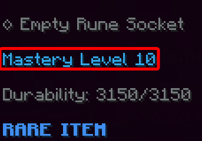
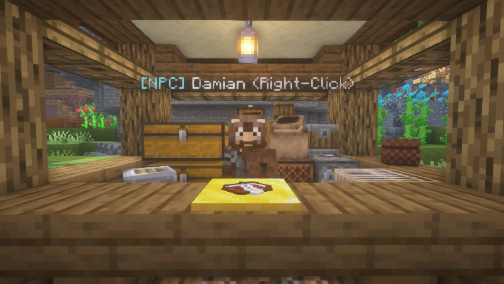

# Custom Items
All about using, crafting, upgrading, and repairing custom items.

## Crafting Custom Items


You can craft and upgrade materials, weapons, repair stones/artifacts, and armor from the Blacksmith. The Blacksmith is located at spawn or at `/crafting`.


You can craft potions, staffs, wands, catalysts, tomes, runes, and item essence from the Sorcerer. The Sorcerer is located next to the Blacksmith at `/crafting`.

## Types of Custom Items

There are a variety of Custom Item types, which each corresponding to different attributes. For instance, Daggers have a fast attack speed but low attack damage, and Greatswords have a slow attack speed and are two-handed but have a high attack damage.

Each type of Custom Items also have different upgrade scalings, which you can view [here](upgrade-scalings.md).

:::warning
Magic Items (from the Sorcerer) cannot be enchanted!
:::

## Look up uses and recipes of Custom Items


You can use the `/lookup item <Custom Item>` command to quickly look up the description, ways of obtaining, crafting recipe (if applicable), and uses of items.

## Weapon and Armor Attributes


All Custom Items have various attributes assigned to them. This can be seen when you hover your mouse cursor over the item.

### All Attributes for Weapons
|**Attribute**|**Description**
| :------------- |:-------------
|Attack Damage|The Melee or Ranged Damage that the weapon deals.
|Attack Speed|The attack speed of the weapon.
|Critical Strike Chance|The chance of dealing a critical strike.
|Critical Strike Power|The percentage of the initial damage a critical strike deals in extra.
|Range|The range of the weapon.
|Arrow Velocity|The velocity of the arrow.
|AOE Radius|The radius of the area-of-effect damage.
|AOE Damage|The damage of the area-of-effect damage.
|Two Handed|Specifies if the weapon is two-handed. If a weapon with this attribute is duel-wielded, the attack speed will be greatly reduced.
|Magic Damage|Extra magic damage dealt.
|On Hit Damage|The damage that an ability deals.
|Physical Damage|Extra physical damage dealt.
|Projectile Damage|Damage dealt with arrows, staff projectiles, and extra projectile damage.

### All Attributes for Armor and Defense Items
|**Attribute**|**Description**
| :------------- |:-------------
|Block Power|The percentage of incoming damage that this item can block. 
|Block Chance|The chance that an incoming damage will be partially blocked. 
|Dodge Chance|The chance that an incoming damage will be fully dodged. 
|Parry Chance|The chance of dodging an incoming damage, knocking enemies back.
|Health|The amount of extra health given.
|Movement Speed|The amount of extra movement speed given.
|Defense|The amount of defense points the item grants (NOT to be confused with Armor). [Click here to read more](#defense-vs-armor---whats-the-difference).
|Max Mana|The amount of extra mana the item can grant to your total mana.
|Mana Regeneration|The speed of the mana regeneration.
|Skill Cooldown Reduction|The percentage of the cooldown timer for item skills.
|Elemental Damage|See below.

## Defense vs. Armor - What's the difference?
[Armor](https://minecraft.fandom.com/wiki/Armor#Damage_protection) is a vanilla Minecraft item attribute. You will see the Armor attribute used in vanilla armor, such as Iron and Diamond armor. 

Due to Minecraft limitations with high damage values, Defense had to be introduced. Defense is used in most custom armor, and is NOT to be confused with the Armor attribute - they are two completely different variables.

Here is the formula used for the application of defense: <br />
```damage * (0.355 - (defense / (3.325 * (defense + 150)))) - 2``` <br />

This formula returns the final amount of damage dealt.

## Weapon Elemental Damage


Custom Items can have an Elemental Damage attribute. Elemental Damage (%) represents the chance for an item to perform an Elemental Critical Attack. Elemental Critical Attack effects are listed below.

|**Element**|**Critical Attack Effect**
| :------------- |:-------------
|Fire|Sets target entity on fire (Duration scales with attack damage).
|Ice|Roots target entity (Duration scales with attack damage).
|Wind|Performs an AOE knockback.
|Earth|Performs an AOE knockup.
|Thunder|Deals 20% of the initial attack damage to nearby entities.
|Water|Performs an AOE slow (Duration scales with attack damage).

## Weapon and Armor Skills


All Custom Weapons and Armor have their own **special skills**. This can be seen when you hover your mouse cursor over the item. Depending on the weapon, the skill may use mana or have a cooldown. Every skill is unique, so try it out for yourself! For the full list of item skills and the descriptions of them, visit the [Item Skills List](item-skills-list.md) page.

## Upgrading Weapons and Armor


Upgrading an item from the Blacksmith will increase stats on a Custom Item. Items can be upgraded up to 5 times (stars) at the Blacksmith, using item essence and a portion of the item's crafting materials.

:::info
If an item has a rune applied to it, upgrading will also increase stats of the rune(s) given that the upgrade scales the same stats of the runes. For example: If you have a Keen Rune applied on a dagger and you upgrade it, the rune will also be upgraded. However, if you have a Health Rune applied on an armor, it will not be upgraded since armor upgrades do not increase health stats. Read below to see each weapon types and its upgrades.
:::

### Upgrade Scalings

Depending on the type and rarity of the item you are trying to upgrade, the results may be different. For instance, daggers get a 4% attack damage and 2.5% attack speed increase per level, while swords get a 6% attack damage and no attack speed increase per level. All scalings of upgrades can be read over at the [Upgrade Scalings](upgrade-scalings.md) page.

Upgrade scaling is compounding, increasing based on its current value. For example: Lets have an item with 10 base Attack Damage with a scaling of 15% per level. The next level would be ```10 * 1.15 = 11.5```, then the next level would be ```11.5 * 1.15 ≈ 13.2``` and so on.

## Item Essence


Item essence is used for upgrading items or repairing items. They can be crafted at the Sorcerer using Essence Powder, which is obtained by killing any normal or custom mobs.

## Repairing Custom Weapons, Tools, and Armor


Custom Items are repaired using Repair Stones and Artifacts based on their rarity. Repair Stones repair 30% of the item's max durability, while Repair Artifacts fully repair an item. Repairing items can be crafted from the Blacksmith under the Repairing section.

## Mastery Levels



Most Custom Items require certain Mastery Levels to use. Your Mastery Level is your mcMMO Power Level (`/mcstats`) minus your mcMMO Acrobatics (`/acrobatics`) level.

You can check your mastery levels with `/mastery`.

## Runes


Runes are used to upgrade stats on Custom Items. Depending on the type of the Rune, it may increase the amount of damage, critical strike chances, and more. Runes are crafted from the Sorcerer under the Runes section.

|**Rune**|**Bonus**
| :------------- |:-------------
|Sharpness|Grants 0.1-1.5 Attack Damage.
|Keen|Grants 1-2% Critical Strike Chance and 1-3% Critical Strike Power.
|Toughness|Grants 1-5% Knockback Resistance.
|Spell|Grants 5-10% Magic Damage and 1-10% Skill Cooldown Reduction.
|Intellect|Grants 0.5-3 Max Mana.
|Wisdom|Grants 0.2-1.5 Mana Regeneration.
|Defense|Grants 0.1-4 Defense.
|Health|Grants 2 Health.

:::tip
Upgrading an item also upgrades runes applied it (if applicable). See the [Upgrading Weapons and Armor](#upgrading-weapons-and-armor) section for more info.
:::

<!-- ## Armor Tiers
Here are all the full armor sets ordered by the amount of defense from least to greatest.
**Note that this order does NOT take full set bonuses, skills, items, or enchantments into account, which can all affect total defense greatly.**

|**Armor Set**|**Defense**
| :------------- |:-------------
|Vanilla Iron|N/A
|Starter|N/A
|Orc|N/A
|Vanilla Netherite|N/A
|Evergreen|N/A
|Geo|11
|Scorched|22
|Glacial|45
|Gemstone|66
|Warden|77
|Infernal|91
|Reaper|103
|Spellbound|124
|Slate|150
|Cryohex|147
|Desert Assassin|195
|Void Warrior|219
|Volcanic|289
|Blizzard|340
|Titanic|460 -->

<!-- ## Slate Armor Set
Skipping from an Overworld armor set to the Slate armor set is **STRONGLY DISCOURAGED** due to the difficulty of the Basalt Deltas. You **WILL** suffer. **You have been warned!** -->

## Item Merchant



The item merchant will offer you a range of randomized sell prices for random custom materials. Each day, the catalogue will refresh with new items and prices.

Per each quantity of item sold, the sell price of the item will decrease by 1%. However, the sell price cannot be decreased below 20% of the original sell price for that day. 
:::info
For example, if the sell price of Toughstone for the day was $228 and you sold 32 Toughstone, you would earn $1,654 (sell price decreases by 1% per each quantity), and the sell price of the item cannot decrease below $46 ($45.60 rounded up to a whole dollar).
:::

You can also bribe the merchant to increase the sell price of a random item by 6-15%. There is no limit to bribing, and bribing bypasses any sell price limits, but the cost to bribe will increase exponentially until it resets the next day.