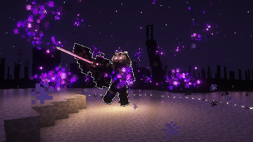

# Custom Mobs

## Types of Custom Mobs
There are various types of Custom Mobs: Regular Mobs, Mini Bosses, World Bosses, and Arena Bosses.

### Regular Custom Mobs (This wiki page)

Spawns randomly around various worlds and biomes.

### [Mini Bosses](mini-bosses.md)

Custom Mobs that are harder to kill than regular mobs. Features higher rewards and semi-exclusive drops.

### [World Bosses](world-bosses.md)

Custom Mobs that require manual summoning, and are much harder to kill than regular mobs and mini-bosses. Features high rewards and exclusive drops.

### [Arena Bosses](../gameplay-mechanics/boss-fights.md)

Custom Mobs that are fought in an arena, featuring rewards, exclusive drops, and unlocks to various regions.

## Spawning of Regular Custom Mobs
Regular Custom Mobs spawn randomly in the Overworld, Nether, The End, [Miner's Mountain](../gameplay-mechanics/miners-mountain.md), and [Skylands](../skylands/skylands.md). Each mobs have their own respective dimensions and biomes they spawn in.

## Where does a certain mob spawn?
If you are trying to obtain a material and are wondering where a certain custom mob spawns, use the `/lookup mob <mob name>` command. The command will tell you what worlds and biomes a certain mob spawns in.

Alternatively, spawning information can be found in the [Items List](../custom-items/items-list.md) wiki page.

## Drops of Regular Custom Mobs
Every Custom Mobs each have a unique drop table consisting of different Custom Items, points, and XP. The more difficult a mob is, the more points, XP, and higher value items it will drop.

:::note
The Fortune enchant does not affect Custom Drops due to limitations.
:::