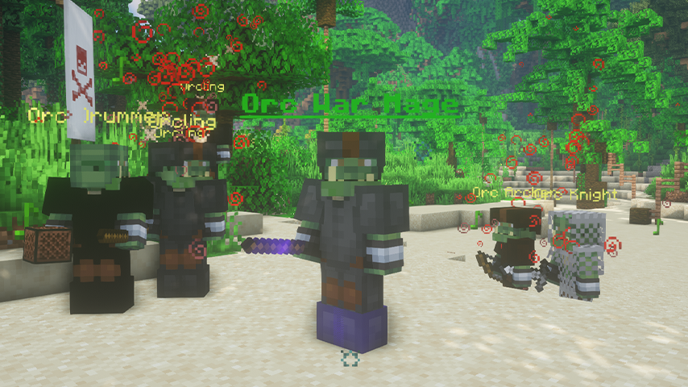
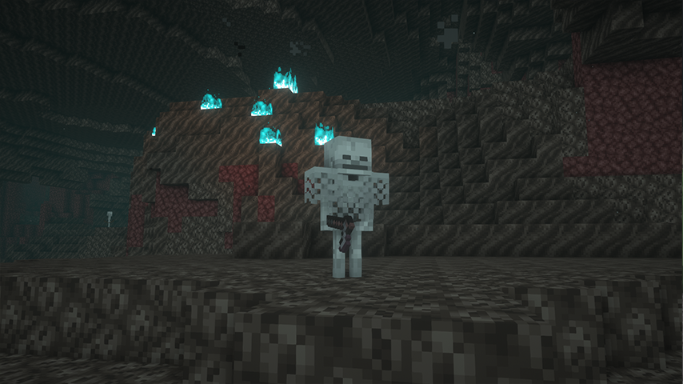
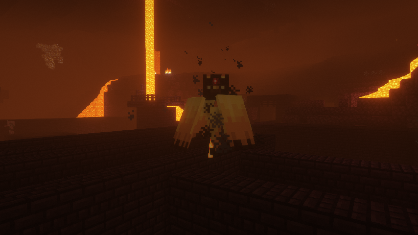
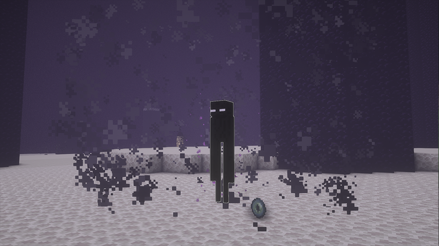

# Mini Bosses
Mini Bosses and where to find them.

Mini Bosses can be found in all parts of the world and are much harder to kill than normal mobs. Mini bosses drop much more money, XP, and Points than normal mobs.

## Overworld
### Esgand

**Spawn Locations:** All Biomes  
**Difficulty:** Easy  
**Drops:** $200 - $300 & 60 XP, 30 Points, 3-4 Essence Powder  

### Orc War Mage

**Spawn Locations:** Temperate Biomes  
**Difficulty:** Easy  
**Drops:** $400 - $500 & 100 XP, 50 Points, 3-6 Essence Powder, 1-2 Orc Tooth, War Mage Staff (Rare)  

### Necromancer

**Spawn Locations:** Ocean Biomes  
**Difficulty:** Medium  
**Drops:** $800 - 900 & 200 XP, 75 Points, 5-7 Essence Powder  

### Leviathan

**Spawn Locations:** Ocean Biomes  
**Difficulty:** Medium  
**Drops:** $1,200 - $1,500 & 300 XP, 100 Points, 8-9 Essence Powder, 1 Leviathan Tail  

## Nether
### Skeleton Shaman

**Spawn Locations:** Soul Sand Valley  
**Difficulty:** Hard  
**Drops:** $1,300 - $1,600 & 300 XP, 100 Points, 1 Skeleton Shaman Soul, 8-9 Essence Powder  

### Wildfire

**Spawn Location:** Nether Fortresses  
**Difficulty:** Hard  
**Drops:** $1,200 - $1,500 & 300 XP, 100 Points, 4-8 Blaze Rods

## End
### Arcane Shadowmage

**Spawn Locations:** Main End Island  
**Summoning:** Killing Unstable Lesser Shadows (Emits purple particles)  
**Difficulty:** Insane  
**Drops:** $1,500 - $1,800 & 300 XP, 150 Points, 1 Arcane Fragment, 10-11 Essence Powder  