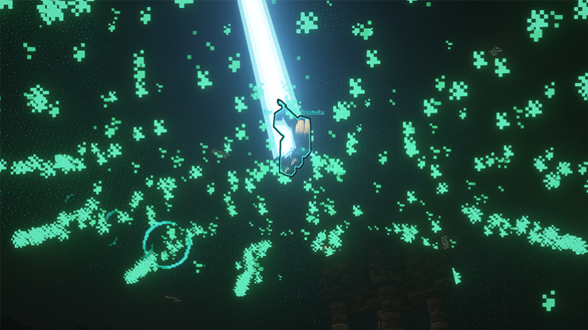
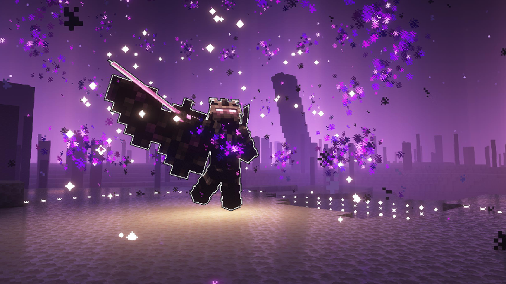

# World Bosses
About and how to summon World Bosses.

World Bosses are bosses that can be fought in any of the survival worlds but require a specific method of summoning. World Bosses often require a lot more players to defeat as they have a lot of health and may be more difficult than some Bossses.

## Warden Anomaly

**Location:** Overworld (Warden's Well) 
**Drops:** Warden's Tribute.

### Summoning Steps

Craft the Warden's Call to Archon from the Sorcerer. Upon crafting the item, you will be sent a coordinate in the chat. Navigate to the coordinate, enter the underground city, and locate the Warden's Well. While holding the Warden's Call to Archon, right-click next to the Warden's Well. Summon a Warden as usual, and while the Warden's Call to Archon is active, it will summon the Warden Anomaly.

## Acheron

**Location:** Nether (Acheron Arena) 
**Drops:** Heart of The Fell Crimson, Infernal Soul, Crimson Essence, Netherite Scrap, Intertwined Crystal, EXP

### Summoning Steps

Craft the Crimson Crown from the Sorcerer. Head to the Acheron Arena located near /warp nether. While holding the Crimson Crown, right-click in the Arena to summon Acheron.

## The Voidkeeper

**Location:** The End (Main Island)
**Drops:** Heart of the Void, Arcane Fragment, Void Essence, Corrupted Eye, Diamond, Diamond Block, Netherite Ingot, Netherite Block, 6,000+ XP.

### Summoning Steps

Upon killing Lesser Shadows, there is a very small chance of summoning a Corrupted Anchor which will deal damage within a radius. After destroying the Corrupted Anchor a ritual will spawn containing 4 Netherite Seals. Upon destroying all 4 seals the Voidkeeper will be summoned.