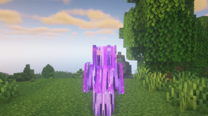

# FAQ
Frequently asked Questions and the answers. No, really, I swear this FAQ is actually useful.

### Is Keep Inventory on?
Keep Inventory is on throughout the entire server. However, you will lose 10% of your balance on death in the Overworld, Nether, The End, and the Skylands. You don't lose any in boss arenas or dungeons.

### How do I claim land?
Use `/claim` to claim land. [Click here for more information such as sharing and managing claim permissions.](../getting-started.md/#claiming-land)

### How do I obtain X item? What is X item used for?
Use the `/lookup` command to view how to obtain an item, and look up all recipes an item is used in.
Alternatively, for an in-depth detail on how to obtain an item, visit the [Items List](../custom-items/items-list.md) section of the wiki.

### What does X enchant do?
Use the `/lookup` command to view the descriptions, max levels, rarities, and conflicts of custom enchantments.

### Does Looting work for Custom Drops?
Looting does not apply on custom drops, as currently it is not possible to do so.

### Why can I not combine an enchanted book with my item?
You are either:
1. Attempting to combine an enchantment that is not meant for the item type (ex. Force on a Sword)
2. There are conflicting enchantments on the item/book (ex. Vein and Blast Mining)
3. Attempting to combine a Special/Spell enchantment on an item that already has one (there is a limit of 1 each.)
4. Playing on Bedrock Edition (Make sure you are using the sneak-click anvil, NOT the normal anvil). However, the sneak-click anvil still has a few issues.

Refer to the [Custom Enchants](../gameplay-mechanics/custom-enchants.md) for more info.

### Is Infernal Touch and Fortune compatible?
Yes, Infernal Touch will smelt all items multiplied from Fortune.

### Is Vein and Fortune compatible?
Yes, Fortune will multiply all ores mined from Vein.

### How difficult is boss X or dungeon X / what armor should I have for boss X or dungeon X?
Unfortunately, it is not possible to sum up the difficulties of bosses and dungeons into a singular defense value or armor set. There are way too many variables from stats, abilities, custom enchants, item upgrades, item skills, and the pure huge skill differences between players. There are [Community Wikis](../community-wikis/community-wikis.md) that share a general progression guide, but keep in mind there are *many* other variables to consider. Having a high defense value doesn't mean you can ignore all those other variables.

### Why does my armor texture look glitched?

This is caused by using shaders. Unfortunately, this is caused by limitations with [Optifine](https://github.com/sp614x/optifine/issues/6391) and [Iris](https://github.com/IrisShaders/Iris/issues/1042), and cannot be fixed.

### Why do I not have a health bar / Why does my HUD look broken?
Visit the [HUD Issues](../issues/hud-issues.md) section of the wiki.

### What is Item Essence used for?
Visit the [Item Essence](../custom-items/custom-items.md/#item-essence) section of the wiki.

### How do you pick up spawners?
You can pick up spawners using a pickaxe with Silk Touch. You don't need any ranks or other enchantments.

### Can I only remove certain enchantments from an item, and/or turn them back into a book?
No, because that would make things too easy :)

### Is there a bank to store your money so you don't lose it?
No, because again, that would make things too easy :)

### What is the difference between Armor and Defense?
Visit the [Defense vs. Armor - What's the difference?](../custom-items/custom-items.md/#defense-vs-armor---whats-the-difference) section of the wiki.

### Are TNT Explosions/Fire Tick on?
TNT Explosions and Fire Tick is disabled, as they are frequently abused for griefing. However, bed explosions are enabled (only in the Nether).

### What is the difference between the normal (/rtp) world and the /resource world?
The resource world is generated using vanilla world generation. It features increased passive mob spawn rates, more structures, and no custom mobs. The resource world resets once every few months.

### Do claims include blocks above and below?
Yes, claims will protect your region all the way from bedrock to world height limit.

### Where do I find an Ancient City?
**Ancient cities are best found in the `/resource` world.** The main world (`/rtp` world) does not have as many ancient cities, and most of them will be buried. This is due to limitations regarding custom world generators with Minecraft.

### What is the vanilla difficulty of the server?
The vanilla difficulty of the server is normal.

### How do I submit a Suggestion or a Bug Report?
See the [Suggestions and Bugs](../issues/suggestions-and-bugs.md) page. **THE CHAT IS NOT THE CORRECT PLACE FOR THEM!**

### Why do treasure maps not work?
Treasure maps are disabled as they cause severe lag spikes. Treasure maps load infinite chunks until it finds a structure - basically, imagine flying at light speed until it finds a treasure or the server crashes. Thanks Mojang.

### How do I use fancy colors in commands such as /nick, /rename, etc?
Use these [color codes](https://i.redd.it/yldfhnb4xp411.png), or if you want to use gradients and hex colors, [use this website!](https://www.simplymc.art/Gradients)

### Are dungeon chests shared?
Dungeon chests are not shared. They are per-player.

### Why do my ability slot numbers keep changing?
The ability slot numbers that appear when you go into ability casting mode depends on your current active slot on your hotbar.

For example: In the `/abilities` menu, let's say you have Fire Storm bind to slot 1, Furtive Strike bind to slot 2, and Minor Healings bind to slot 3.

- If you have the first slot selected on your hotbar and go into ability casting mode, you will now have Fire Storm bind to [2], Furtive Strike bind to [3], and Minor Healings bind to [4].

- If you have the second slot selected on your hotbar, you will now have Fire Storm bind to [1], Furtive Strike bind to [3], and Minor Healings bind to [4].

- If you have the eighth slot selected on your hotbar, you will now have Fire Storm bind to [1], Furtive Strike bind to [2], and Minor Healings bind to [3].

This is due to a Minecraft limitation unfortunately - there is no way for the server to be notified of a key press event if you select a slot that is already selected.

### Why do my arrows keep bouncing off enemies?
If this is happening, you are either shooting arrows too quickly, or you are too far away from the mob.

Minecraft will bounce off arrows if an entity is hit during its invulnerability period. Therefore, if you are shooting arrows too quickly (especially with a bow that has Succession Custom Enchant applied on it), you will see this behavior often. We cannot do anything about this.

Arrows will also bounce off if you are too far away from the mob (past the mob's activation range).

### What is the World Size?
**Overworld** - 24,000 x 24,000  
**Nether** - 8,000 x 8,000  
**End** - 24,000 x 24,000  
**Resource** - 24,000 x 24,000  

### Is Chat Reporting (1.19.1) enabled?
Chat reporting is disabled due to compatibility and security issues.

### Can I download the resource pack instead of having to load it every time I join?
Unfortunately, we cannot provide the resource pack. The resource pack gets frequent updates, and your textures would appear broken.

### Are cracked accounts supported?
Cracked accounts are not supported and will never be supported, as it is physically impossible to do so following the enormous amounts of internal complications and security vulnerabilities it brings. Some examples are:
- No secure account authentication
- Having to support offline UUIDs
- No account lookups
- Minimal server software/plugin support
- Endless vulnerabilities regarding accounts
- Risks of botting to the server and backend services

There are moral complications as well. Supporting cracked accounts are *highly* frowned upon in the Minecraft server community - and we are not an exception.

### Will there be a Nether/End/Resource World reset?
There will be a Nether/End/Resource World reset once in a few months.

### Will there be a server reset?
There will never be a server reset, unless the majority of the community wants it.