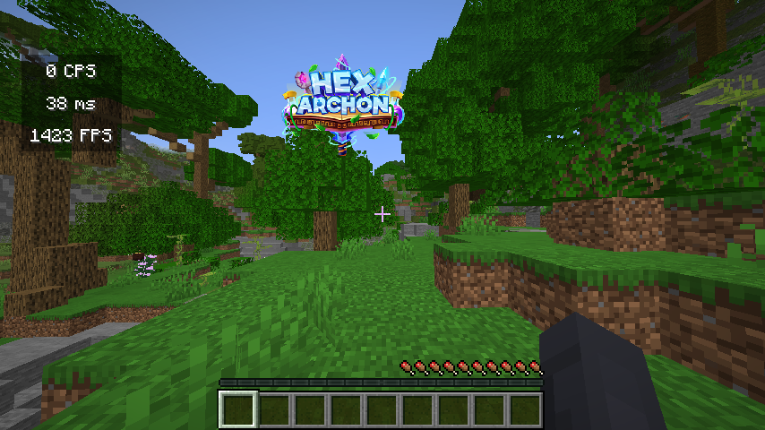
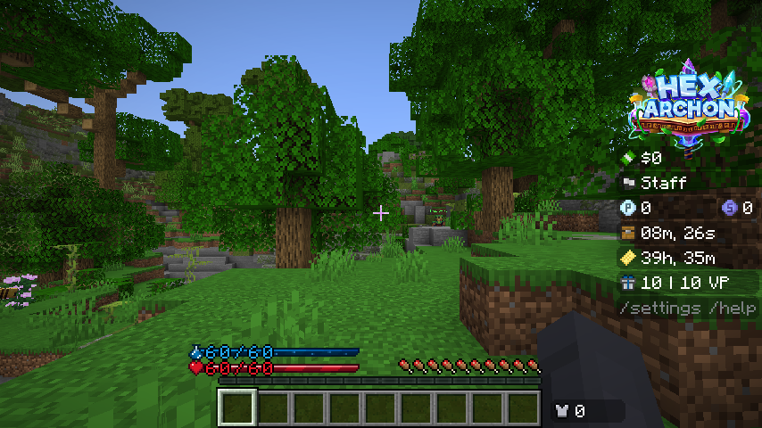
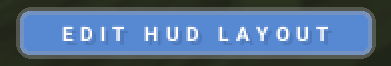

# HUD Issues
How to fix issues related to the Custom HUD.

## Health bar not loading / HUD looks messed up
If your health bar is not loading or your HUD looks messed up, it is likely caused by a 3rd party Minecraft client settings or mods that tweak GUI scales or boss bars.

### Example of a broken HUD:
  

### Example of a properly functioning HUD:
  

## Lunar Client Fix:
### Fix 1:
Lunar Client has a setting to use a custom GUI scale different from vanilla Minecraft, which breaks the HUD.

  
To fix this, in Lunar Client's settings tab, make sure that the "Use Minecraft GUI Scale" option is set to **mods** or **all** (not off).

### Fix 2:
Lunar Client has a setting to disable the boss bar, which also disables the HUD.

  
In Lunar Client's HUD tab, make sure that you have boss bars enabled.

### Fix 3:
Lunar Client has a setting to customize the boss bar, which can break the HUD.

  
To fix this, go to Lunar Client's HUD tab, and click the settings icon next to the boss bar option.

  
Then, at the top right corner, click BOTH **"Reset Position"** and **"Reset to Defaults"** buttons.

### Fix 4:
Lunar Client has an option to freely move around the boss bar, which can break the HUD.

To fix this, open Lunar Client's options, and at the bottom left corner, click the blue **"Edit HUD Layout"** button.
  

  
Then, drag the boss bar element to the position as shown.

## Other Clients Fix:
Check your client settings to see if there are any settings that tweak GUI scales or boss bars. Try tweaking or disabling those options to see if the issue is fixed (refer to the Lunar Client fixes if necessary.)

If you're using a client not listed on this wiki page and have found a solution, let us know on the [Discord](https://discord.hexarchon.net/) so we can add the solution to this wiki page.

## Fabric/Forge/Quilt Fix:
If you are on a modded platform such as Fabric, Forge, or Quilt and are experiencing broken HUD, one of your installed mods are causing the issue.

Check through your mods list to see if you have any mods that tweak GUI scales or boss bars. Try removing those mods, and see if the issue is fixed.

If you found a mod that breaks the HUD, let us know on the [Discord](https://discord.hexarchon.net/) so we can add the mod name to this wiki page.

## Why don't you fix these issues so I don't have to deal with it?
Unfortunately, there is no way from the server side to fix these issues. If you join the server on vanilla Minecraft, you will see that the HUD works perfectly fine. 3rd party Minecraft clients and mods can adjust your client in ways that would not be possible on a vanilla Minecraft client - therefore, the server cannot do anything about it.