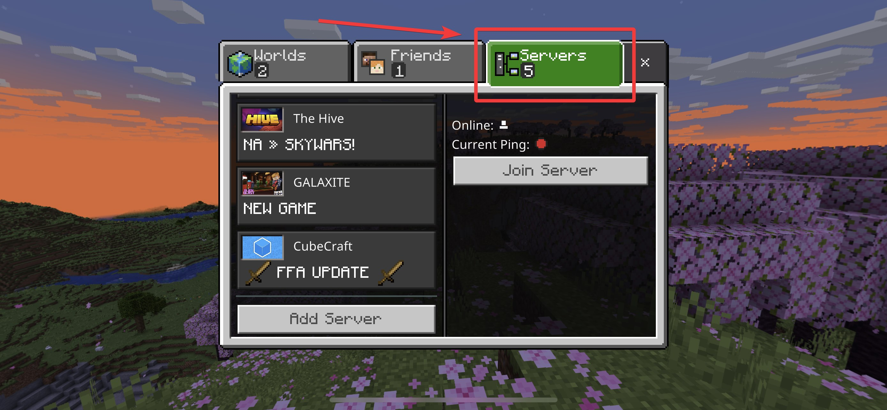
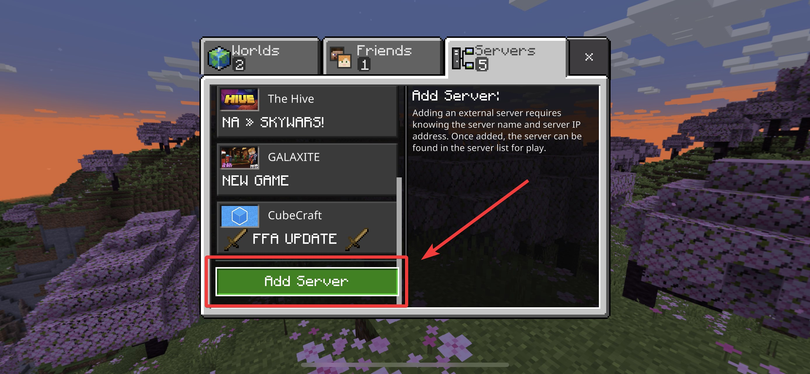
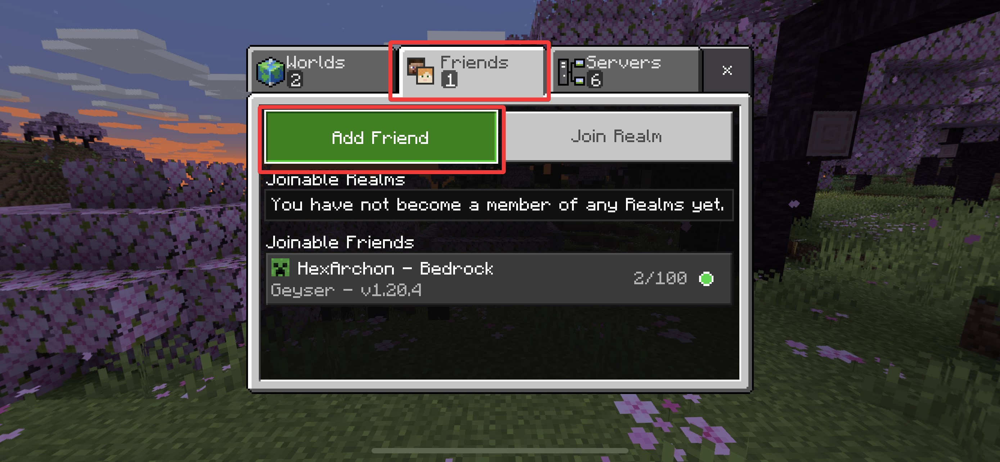
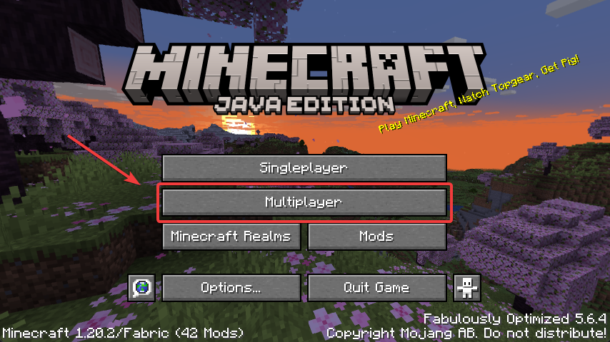
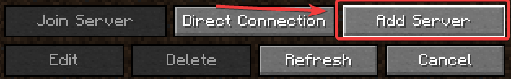

# How to join the Server (Bedrock & Java)
How to join the server on a variety of platforms.

### [Joining on Bedrock Edition (PC and iOS/Android)](./joining-the-server.md/#bedrock-edition-pc-and-iosandroid)
### [Joining on Console Bedrock Edition (Xbox, PS4/PS5, Switch)](./joining-the-server.md/#console-bedrock-edition-xbox-ps4ps5-switch)
### [Joining on Java Edition (PC)](./joining-the-server.md/#java-edition-pc)

## Bedrock Edition (PC and iOS/Android)
1. Click the Play button.

    
2. Click the **Servers** tab at the top.

    
3. Scroll down and click the **Add Server** button.

    
4. Type `play.hexarchon.net` into the **Server Address** box, and type `19132` into the **Port** box. Make sure to click **Save** to save the server and join.

    

## Console Bedrock Edition (Xbox, PS4/PS5, Switch)
1. Click the **Play** button.

    
2. Click the **Friends** tab at the top of the screen, and click **Add Friend**.

    
3. Add "HexArchonServer" as a Friend.

    
    
4. After adding "HexArchonServer" as a Friend, wait 30 seconds to 1 minute for the friend list to update. Then, the server will show up.

    

## Console Bedrock Edition OLD METHOD (Xbox, PS4/PS5, Switch)
:::warning
Only use this method if the first method does not work! This method is more complicated.
:::

### PlayStation
<iframe width="509" height="286" src="https://youtu.be/0MJVVhDeu2s?t=348" title="Video 1" frameborder="0" allow="accelerometer; autoplay; clipboard-write; encrypted-media; gyroscope; picture-in-picture; web-share" allowfullscreen></iframe>

### Xbox
<iframe width="509" height="286" src="https://youtu.be/g8mHvasVHMs" title="Video 2" frameborder="0" allow="accelerometer; autoplay; clipboard-write; encrypted-media; gyroscope; picture-in-picture; web-share" allowfullscreen></iframe>

### Switch
<iframe width="509" height="286" src="https://youtu.be/zalT_oR1nPM" title="Video 3" frameborder="0" allow="accelerometer; autoplay; clipboard-write; encrypted-media; gyroscope; picture-in-picture; web-share" allowfullscreen></iframe>

Once you have followed one of the videos above, use `play.hexarchon.net` as the Server IP address and `19132` as the port.

## Java Edition (PC)
1. Click the **Multiplayer** button.

    
2. Next, click the **Add Server** button at the bottom.

    
3. Type `play.hexarchon.net` into the **Server Address** box. Make sure to have the **Server Resource Packs** option Enabled.

  