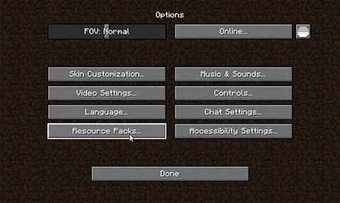
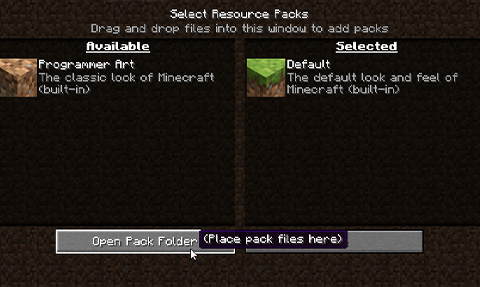

# Resource Pack Issues
How to fix issues related to the resource pack.

## Section 1. 
### The resource pack won't download / I see white squares!
1. In the Minecraft multiplayer menu, select HexArchon. Click the "Edit" button in the bottom left corner.  
  

2. In the menu, set the "Server Resource Packs" option to "Enabled". Then, click "Done".  
  
3. Join the server, and the resource pack should now download. If the resource pack is still not downloading, try restarting Minecraft, or follow section 2.  

## Section 2. 
### The resource pack gets stuck downloading / I keep getting disconnected downloading the resource pack!
1. Open the "Options" menu.  
  

2. Click the "Resource Packs" button.  
  

3. Click the "Open Pack Folder" button.  
  

4. Click on the ".minecraft" text in the address bar of your File Explorer.  
  

5. Find the folder called `server-resource-packs`, and navigate into it by double clicking on it.
:::warning
If this folder does not exist, right-click an empty area of your File Explorer, click "New", and then "Folder". Name the folder "server-resource-packs". Restart your game, and see if the issue is fixed.
:::
  

6. Once you are in the `server-resource-packs` folder, delete everything in the folder. Restart your game, and see if the issue is fixed.

## Section 3. 
### My game crashes while loading the resource pack!
1. Try following the steps for the issue listed above. If you are still having issues, continue to the next step.  
2. In your Minecraft launcher, click "Installations."  
  
3. Click the 3 dots next to your corresponding Minecraft installation, and click "Edit".  
  
4. In the "JVM Arguments" box, type `-Xmx4G`. The number 4 represents the amount of memory you will be allocating to Minecraft. If your computer has a sufficient amount of memory, you can increase this value.  
  