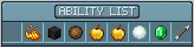
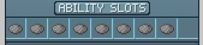

# Abilities

Abilities play a huge role in progress as they grant special passive and active skills. The abilities menu can be accessed with `/abilities`.

## Obtaining Points

Points  can be obtained by killing custom mobs, bosses, and opening crates. With points , you can purchase ability points , used to upgrade abilities. With 4 ability points , you can increase your ability activation level, which will unlock new abilities.

## Abilities Menu

This is the main abilities menu, which you can open by typing `/abilities` and clicking "Open Ability Menu". Here, you can upgrade abilities and bind certain abilities to slots.

## Viewing and Selecting Abilities

This is where you can scroll through and view all available abilities. Here you can click on an ability you own, which will select the ability.

## Upgrading Abilities

While an ability is selected, you can choose to upgrade it by clicking on the middle item. To the left, you can view your selected ability's current level, and to the right, you can preview your selected ability's next level.

## Binding Abilities

While an ability is seleted, you can bind it to one of the 6 slots by left-clicking on an unactive slot. The slot you bind an ability to will determine the number you would press to activate the ability.
To unbind an ability from a slot, you can right-click on an occupied slot.

## Using Abilities

### Tutorial Video:
This tutorial video guides you on how to bind abilities, activate ability casting mode, and how to cast abilities.
<iframe width="509" height="286" src="https://www.youtube.com/embed/G2qp1CEketA" title="HexArchon - How to use Abilities" frameborder="0" allow="accelerometer; autoplay; clipboard-write; encrypted-media; gyroscope; picture-in-picture; web-share" allowfullscreen></iframe>

### Explanation:

To cast abilities, you must be in casting mode. You can toggle casting mode on/off by pressing the `F` (Swap Item) key. From here, the binded abilities will be shown above your hotbar. To cast an ability, press the associated number shown to the left of the ability name.

In this example, you would press the `2` key to cast Fire Storm, `3` to cast Minor Healings, and `4` to cast Empowered Attack.

## Mana

Most abilities require mana, which is displayed as the blue bar above your hotbar. To obtain more mana or to increase the regeneration speed of your mana, you can upgrade your intelligence stat in `/stats`, or craft custom items or runes that increase your mana gain.