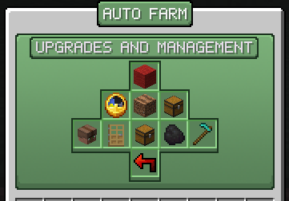

# Auto Farms
How to use and upgrade Auto Farms.

Auto Farms can be bought in the `/shop`. Farms are fully automatic, do not require a water source, and will replant/replace/pick up any crops/ores in its radius.

## Accessing the Storage
The farm storage can be accessed by right-clicking on the farm.

## Upgrading and Managing Auto Farms

You can left-click on auto farms to bring up the upgrade/manage menu. From there, you can choose to upgrade the radius, speed, and storage capacity. You can also choose to share access to the auto farm, or to provide more fuel.

## Fueling Auto Farms
You can fuel auto farms by left-clicking on them to bring up the managing menu. From there, select the fuel icon, and place in a valid fuel source to increase the run time.

## Destroying Auto Farms
Auto farms can be destroyed by shift-left-clicking on them. They will drop as an auto farm item, and all upgrades will be kept.

## Ore Farms
Diamond, Emerald, and Coal ores **cannot** be collected by ore farms!
