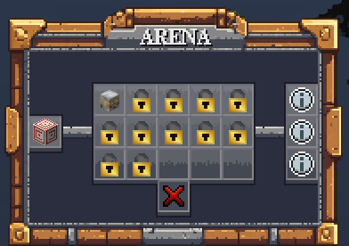
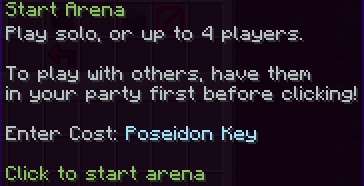
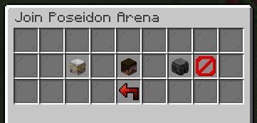

# Boss Fights

Arenas offer you challenging boss fights that you can take. As you unlock new bosses, they will get progressively harder, with each bosses having their own unique abilities and skills. The rewards include money, points, XP, and unique emblems for each bosses.

Up to 4 players can join a single boss arena, in which the amount of rewards will be dependent on the first/repeat completion divided by the amount of players. The health of bosses will increase by half of the boss' base HP per additional player.

## Practicing for a Boss Fight

You can practice any Boss Fights **for free** in the practice realm. Use `/practice` to navigate to a practice range.

:::warning
**It is strongly encouraged** to practice before starting a real boss fight, so that you are prepared and you don't waste your entry costs by dying!
:::

## Starting a Boss Fight
To start a Boss Fight, open the boss menu using `/boss`. Select a boss to fight. Click "Start Arena" to start the boss fight solo, or co-op with up to 4 players _(must have a party setup before starting)._

### Boss Fight Entry Costs

Boss Fights require a key for the corresponding boss. For example: You need a Poseidon Key to start a Poseidon Boss Fight (Arena 1). Visit the [Blacksmith](../custom-items/custom-items.md/#crafting-custom-items) at `/crafting` to craft a Boss Key.

## Creating a Party

If you would like to do a boss fight with other players, they must be in your party first before you click the "Start Arena" button. When you click on a boss head, you will be given the option to start inviting players.

### Inviting Players Privately
To invite players to join your party, click the "Create Party" button. Use the `/party invite PlayerNameHere` command to invite others to join your party.

### Inviting Players Publicly (Recruiting)
To create a global broadcast for players to join your party, click the "Recruit Players" button. Follow the steps in the chat and type your answers in the chat to start recruiting players.

## Leaving a Boss Fight

To leave a boss fight, use the `/leave` command. **Warning: You will NOT get any entry cost refunds!**

## Completing a Boss Fight

Once you successfully complete a boss fight, the corresponding rewards will be given to you. If you kill the same boss again, you will now be given the rewards listed under "Repeat Rewards" instead.

### Reward Distribution (Party)
If you complete a boss fight with multiple players in a party, the following rules will apply:
- If no one in the party has completed the boss yet, the boss will drop an emblem for each player.
- If everyone in the party has already completed the boss, the boss will drop an emblem for each player.
- If neither is the case, then the boss will only drop an emblem to players who have not yet completed the boss.

## Failing to Complete a Boss Fight
If you fail to complete a boss fight (by dying or using `/leave`), you will keep your inventory, but **you will NOT get a refund on your entry cost.**