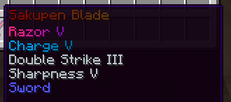
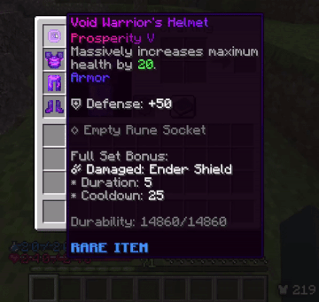

# Custom Enchants

Custom Enchants are new, unique enchants that you can apply to armor and tools, which play a major role needed to progress.

## Obtaining Custom Enchants

Custom Enchants can be purchased with money from `/shop` under Custom Enchants. They can also be obtained at random from enchanting tables, villagers, dungeons, crates, fishing, drops, daily rewards, and events.

:::tip
You can quickly open the Custom Enchants menu with `/ce`.
:::

## Applying Custom Enchants

Custom Enchants can be applied to items by using an anvil, similar to vanilla Minecraft.

**IMPORTANT: On Bedrock Edition, you need to use the custom anvil menu (sneak-click a normal anvil) to be able to apply custom enchants on items.**

:::warning
Some enchants may conflict with another enchant, preventing you from applying them together on one item. You can check if an enchant has any conflicts using the `/lookup enchant <enchantment>` command.
:::
:::warning
Mending, Power, Indestructibility, and Repairing cannot be applied on custom items! This is due to limitations of non-modded Minecraft.
:::

## Combining Custom Enchants

Custom Enchants can be combined together, following the exact vanilla Minecraft rules. For example, if you had two Dodge I books, the result would be one Dodge II book.

## Types of Custom Enchants

Below are the various types of Custom Enchants.

### Normal (Gray)
A normal Custom/Vanilla enchant. **There is no limit on the amount of enchants of these kinds you can apply on an item.**  
### Special (Pink)
A more powerful & rare enchant. **You can only apply one special enchant on an item.** 
### Spell (Blue)
Enchants that require manual activation (usually in the form of shift + right click), with an activation cooldown. **You can only apply one spell enchant on an item.** 

:::warning
One MORE warning since a lot of people miss this: You can only apply **ONE** special and **ONE** spell enchant on an item.
:::

## Rarities

Various Custom Enchants have different rarities. They range from common, uncommon, rare, epic, legendary, special, and very special. The higher rarity an enchant has, generally the more powerful it is, and more rare it is from enchanting tables, villagers, dungeons, crates, fishing, drops, daily rewards, events... etc.

## Stacking Enchantments

You can stack enchantments for greater effects. For instance, stacking the Prosperity enchantment will grant extra health on top of your other Prosperity enchantments. If the enchantment is chance based, the chance will increase. However, they will all share the same cooldown.

## Look up Enchantments

You can easily look up all about an enchantment by using the command `/lookup enchant <enchantment>`. This will tell you what the enchantment does, the max level, and what it can be applied to.

## Get the list of Enchantments of Held Item

Are enchantments not showing (issue with shields/Bedrock Edition)? Use the command `/enchantslist` to view the list of enchantments that are applied to the item that you are currently holding.