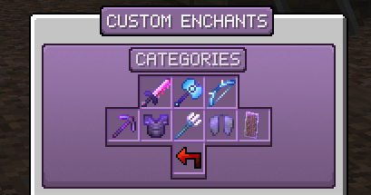

# Custom Enchants

Custom Enchants are all new, unique enchants that you can apply to armor and tools, which play a major role needed to progress.

## Obtaining Custom Enchants

Custom Enchants can be purchased with money from `/shop` under Custom Enchants. They can also be obtained at random from Enchanting Tables, Villagers, Dungeons, Crates, Fishing, Drops, Daily Rewards, and Events.

:::tip
You can quickly open the Custom Enchants menu with `/shop ce`.
:::

## Applying Custom Enchants

Custom Enchants can be applied to items by using an anvil, similar to vanilla Minecraft.

## Combining Custom Enchants

Custom Enchants can be combined together, following the exact vanilla Minecraft rules. For example, if you had two Dodge I books, the result would be one Dodge II book.

## Types of Custom Enchants

Below are the various types of Custom Enchants.

Normal (Gray) - Normal enchant.
Special (Pink) - A powerful, rare enchant.
Spell (Blue) - Enchants that require manual activation.
Artifact (Orange) - Enchants that produce a particle on use.
Curse (Red) - Similar to the vanilla Curse enchantments.

## Rarities

Various Custom Enchants have different rarities. They range from common, uncommon, rare, epic, legendary, special, and very special. The higher rarity an enchant has, generally the more powerful it is, and the higher the rarity.

## Stacking Enchantments

You can stack enchantments for greater effects. For instance, stacking the Prosperity enchantment will grant extra health on top of your other Prosperity enchantments. If the enchantment is chance based, the chance will increase. However, they will all share the same cooldown.

## Look up Enchantments

You can easily look up all about an enchantment by using the command `/whatis <enchantment>`. This will tell you what the enchantment does, the max level, and what it can be applied to.