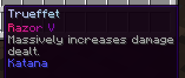
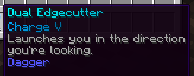

# Custom Enchants

Custom Enchants are all new, unique enchants that you can apply to armor and tools, which play a major role needed to progress.

## Obtaining Custom Enchants

Custom Enchants can be purchased with money from `/shop` under Custom Enchants. They can also be obtained at random from Enchanting Tables, Villagers, Dungeons, Crates, Fishing, Drops, Daily Rewards, and Events.

:::tip
You can quickly open the Custom Enchants menu with `/shop ce`.
:::

## Applying Custom Enchants

Custom Enchants can be applied to items by using an anvil, similar to vanilla Minecraft.

:::warning
Some enchants may be incompatible with another enchant, preventing you from applying them together on one item. You can check if an enchant has any incompatibilities using the `/whatis <enchantment>` command.
:::
:::warning
Mending, Power, Indestructibility, and Repairing cannot be applied on custom items! This is due to the codebase being incompatible.
:::

## Combining Custom Enchants

Custom Enchants can be combined together, following the exact vanilla Minecraft rules. For example, if you had two Dodge I books, the result would be one Dodge II book.

## Types of Custom Enchants

Below are the various types of Custom Enchants.

Normal (Gray) - Normal enchant.  
Special (Pink) - A powerful, rare enchant.  
Spell (Blue) - Enchants that require manual activation.  
Artifact (Orange) - Enchants that produce a particle on use.  
Curse (Red) - Similar to the vanilla Curse enchantments.  

## Special Enchants

Special enchants (Pink) are powerful, rare enchants.
:::warning
Beware that you can only apply one special enchant on an item!
:::

## Spell Enchants

Spell enchants (Blue) are enchants that require manual activation (right-click). They have a cooldown upon activation.

## Rarities

Various Custom Enchants have different rarities. They range from common, uncommon, rare, epic, legendary, special, and very special. The higher rarity an enchant has, generally the more powerful it is, and the higher the rarity.

## Stacking Enchantments

You can stack enchantments for greater effects. For instance, stacking the Prosperity enchantment will grant extra health on top of your other Prosperity enchantments. If the enchantment is chance based, the chance will increase. However, they will all share the same cooldown.

## Look up Enchantments

You can easily look up all about an enchantment by using the command `/whatis <enchantment>`. This will tell you what the enchantment does, the max level, and what it can be applied to.

## Get the list of Enchantments

Are enchantments not showing (Rare Bedrock Edition issue)? Use the command `/enchantslist` to view the list of enchantments that are applied to the item that you are currently holding.