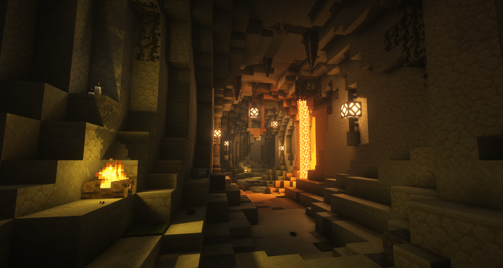

# Dungeons

Dungeons are objective-based raids that contain main & side objectives, mobs, loot chests, and bosses. Upon defeating the final boss of a dungeon, you can claim 1 of 3 reward chests which contain Runes, Custom Enchantments, Essence Powder, Materials, and Custom Items.

## Practicing for a Dungeon

You can practice dungeon bosses **for free** in the practice realm. Use `/practice` to navigate to a practice range.

:::warning
**It is strongly encouraged** to practice before starting a dungeon, so that you are prepared and you don't waste your entry costs by dying!
:::

## Starting a Dungeon

To start a dungeon, open the dungeon menu using `/dungeons`. Select a dungeon to join using the arrows. Click "Start Dungeon" to start the dungeon solo, or co-op with up to 4 players _(must have a party setup before starting)._

## Dungeon Entry Costs

Dungeons require you to defeat a specific boss to join. Dungeons also require a key for the corresponding dungeon. For example: You need to have completed the [Saok Boss Fight](../gameplay-mechanics/boss-fights.md), and have a Runic Temple key to join the Runic Temple Dungeon. Visit the [Blacksmith](../custom-items/custom-items.md/#crafting-custom-items) at `/crafting` to craft a Dungeon Key.

### Dungeon Key Unlock
Once you have successfully completed a dungeon, you will no longer need a key to enter that dungeon. Instead, your entry cost will turn into money. The money entry cost will increase every time you join that dungeon. However, the money entry cost will reset back to the base money entry cost value every day with the daily server reboots.

For Example: You used 1 Runic Temple Key, and completed the Runic Temple dungeon. You no longer need a key to join the Runic Temple dungeon; instead, your entry cost is now $3,000. After entering the dungeon again, if you die, `/leave`, or complete the Runic Temple dungeon again, your next entry cost will be $4,320, then $5,184, and so on. However, next day, your money entry cost will be reset back to $3,000.

The key unlock system works differently if you complete a dungeon in a party. [**For that, please take a look here.**](#reward-distribution-party)

:::info
The formula for the increasing money entry cost is as follows: `<Base Entry Cost> * 1.2^<Amount of Dungeon Attempts>`
:::

## Creating a Party

If you would like to join a dungeon with other players, they must be in your party first before you click the "Start Dungeon" button. When you click on a dungeon, you will be given the option to start inviting players.

### Inviting Players Privately
To invite players to join your party, click the "Create Party" button. Use the `/party invite PlayerNameHere` command to invite others to join your party.

### Inviting Players Publicly (Recruiting)
To create a global broadcast for players to join your party, click the "Recruit Players" button. Follow the steps in the chat and type your answers in the chat to start recruiting players.

## Leaving a Dungeon

To leave a Dungeon, use the `/leave` command. **Warning: You will NOT get any entry cost refunds!**

## Completing a Dungeon

Once you successfully complete a dungeon, you will get access to three different tiers of reward chests. The lowest tier (Tier I) reward chest is free. Higher tier reward chests cost money and XP, but contains higher quality loot. **Note: You can only choose one reward chest to open.**

### Reward Distribution (Party)
Bosses will drop the same quantity of loot regardless of how many players in a party. However, each player in the party will be granted a chance to open a dungeon reward chest.

Only the player who deals the most damage will get a key unlock for the dungeon. One exception: If everyone in the party does not have a key unlock for that dungeon, then everyone in the party will get a key unlock.

## Failing to Complete a Dungeon
If you fail to complete a dungeon (by dying or using `/leave`), you will keep your inventory, but **you will NOT get a refund on your entry cost.**

## Dungeons
The following are the list of dungeons and bosses within.
### Runic Temple

#### Bosses:
- Runic Revenant (Mini-Boss)
- Posessed Treasure
- Runic King (Final Boss)

### Feriah Caverns

#### Bosses:
- Lava Gatekeeper (Mini-Boss)
- Fire Broodmother
- Frost King Servant
- Ruined Frost King (Final Boss)

**Counterpart of Skylands:** [Feriah Farlands](../worlds/skylands.md)

### Ancient Desert

#### Bosses:
- Fallen Knight (Mini-Boss)
- Seth: The Rejected
- Warrior Hyperion
- The Ancient Titan (Final Boss)

### Godseeker Archive

#### Bosses:
- Godseeker's Warden (Mini-Boss)
- The Half Herobrine
- Twin Spirits: Nookron & Necron
- Stratus: Godseeker's Servant
- Godseeker: The Fifth Disciple (Final Boss)