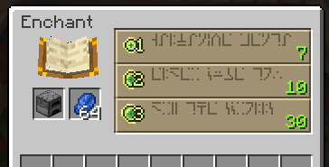
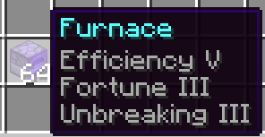
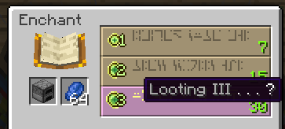

# Furnaces
How to obtain upgraded furnaces.

## Obtaining Upgraded Furnaces

Upgraded Furnaces can be obtained by enchanting a furnace from an enchanting table. Various enchantments provide various upgrades.

## Enchantments

- Efficiency: Increases the smelting speed, and uses more fuel.
- Fortune: Chance to increase the result items. *Only works on certain ores*. See below for applicable ores.
- Unbreaking: Increases the duration that fuel lasts.
- Silk Touch: Causes furnaces to stop using fuel when not in use.

:::info
Ignore any enchantments that show in the enchanting table preview. They don't mean anything.

:::

## Fortune Enchantment
The fortune enchantment on a Furnace will increase the amount of resulting items from smelting. The chance (equation) for Fortune on Furnaces replicates the vanilla behavior of the Fortune enchantment. [You can read more about the vanilla behavior of Fortune (and thus, Fortune furnaces) here](https://minecraft.fandom.com/wiki/Fortune).

**List of items that Fortune on Furnaces will apply on:**
- Deepslate/Gold ore, Raw Gold
- Deepslate/Iron ore, Raw Iron
- Deepslate/Coal ore
- Deepslate/Redstone ore
- Deepslate/Lapis ore
- Nether Quartz ore
- Nether Gold ore