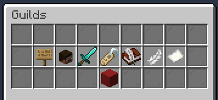

# Guilds
Guilds allow you to create a group for other players to join, which may be useful with co-op. __Guilds are NOT related to dungeon parties in any way - this is a seperate system.__

## Creating a Guild
To create a guild, use the `/g create <GuildName>` command. Creating a guild is free, and there are no maintenance fees.

## Managing your Guild

To manage your guild, use the `/guilds` command. This will bring up a menu where you can manage your guild.

|**Option**|**Description**|
| :------------- |:-------------
Toggle Guild Chat|Toggles your chat mode. When enabled, all your chat messages will only be sent to those in your guild.
Manage Players|Invite, kick, and change guild roles of players.
Friendly Fire Protection|Toggle friendly fire protection on or off. **This option may be handy in dungeons.**
Rename Guild|Rename your guild.
Guilds MOTD|Change the message send to those in your guild when joining the server.
Guilds List|Show the list of guilds.
Guild Nickname|Change your guild nickname.