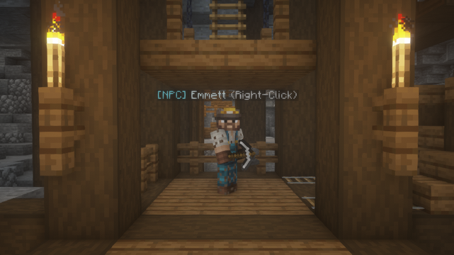
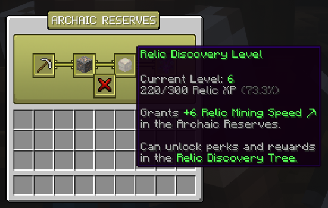
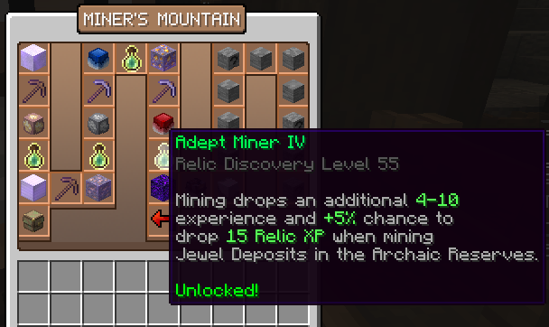

# Miner's Mountain
The Miner's Mountain is a mineshaft containing various ores such as Toughstone, Limestone, Blue, Red, and Purple Jewels, which are valuable crafting materials. You can level up your Relic Discovery Level and unlock many perks in the Relic Discovery Tree.

## Getting Started

To begin mining in the Miner's Mountain, you must first talk to Emmett at `/warp minersmountain`. After completing his dialogue, you can right-click him again to open the Archaic Reserves Menu.

## Pickaxes
To start mining in the Miner's Mountain, you first need to craft a Toughstone Pickaxe. You can obtain Toughstone outside of the Miner's Mountain by mining ores and killing Stone Golems in the overworld. You can craft the Toughstone Pickaxe and other special pickaxes in the Archaic Reserves menu at `/minersmountain` or the Blacksmith at `/crafting`.

## Ore Index

The Ore Index displays all ores in the Miner's Mountain and pickaxes that can break them. The Relic Mining Time (in red) is shown as well as the Relic Mining Speed for each pickaxe (in green).

### List of Ores:
| Ore  | Valid Pickaxes |
| :------------- |:-------------|
|Limestone Deposit|Toughstone, Steel, Hardened Diamond, Blue Crystal|
|Toughstone Ore|Toughstone, Steel, Hardened, Blue Crystal|
|Rich Toughstone Ore|Steel, Hardened Diamond, Blue Crystal|
|Pure Toughstone Ore|Hardened Diamond, Blue Crystal|
|Blue Jewel Deposit|Hardened Diamond, Blue Crystal|
|Red Jewel Deposit|Blue Crystal|
|Purple Jewel Deposit|Blue Crystal|

## Locating Ores
Ores in the Miner's Mountain are grouped together at certain parts of the cave at `/minersmountain`. There are hints throughout the cave that correspond to where certain ores are found - such as, dripstone for limestone deposits, red crystals for red jewel deposits, lava and magma for purple jewel deposits, etc.

## Relic Mining Time and Speed
Relic Mining Time represents the time in ticks it takes for an ore to break. Relic Mining Speed decreases the Relic Mining Time (meaning you can break ores faster), and can be obtained by leveling up your Relic Discovery Level or unlocking certain perks in the Relic Discovery Tree.

## Relic Discovery Level 

Mining ores in the Miner's Mountain grants Relic XP and level up your Relic Discovery Level. Your level can be seen in the Archaic Reserves menu at `/warp minersmountain`.

## Relic Discovery Tree

Upon reaching certain levels, you can unlock perks in the Relic Discovery Tree, such as increased Relic Mining Speed (mine ores faster), increased Relic Discovery experience gain, chances to drop ores, increased duration of Archaic Haste, and more.

## Important Bedrock Edition Note
On Bedrock Edition, the block you're mining will "appear" to be broken (block breaks with particles) - in reality, it's still in the process of breaking. Thus, to fully mine the block, you will need to continue mining the block until it finally breaks (the block will disappear and it will drop an item.)

Unfortunately, this is caused by limitations with Bedrock Edition, as packet manipulation does not get translated onto the client. There is no way to make this work on Bedrock Edition until Mojang introduces proper parity.

Here is a video demonstration of how to mine blocks in the Miner's Mountain on Bedrock Edition:
<iframe width="560" height="315" src="https://www.youtube.com/embed/Q_4k2mL3ZQk" title="YouTube video player" frameborder="0" allow="accelerometer; autoplay; clipboard-write; encrypted-media; gyroscope; picture-in-picture; web-share" allowfullscreen></iframe>