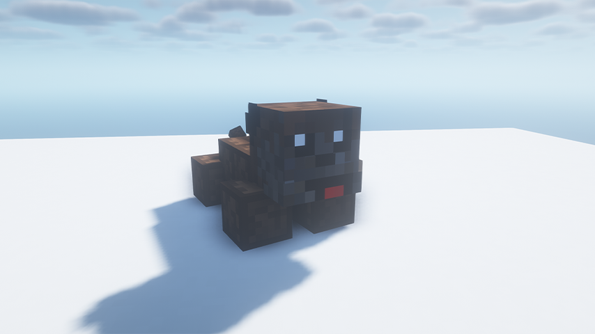
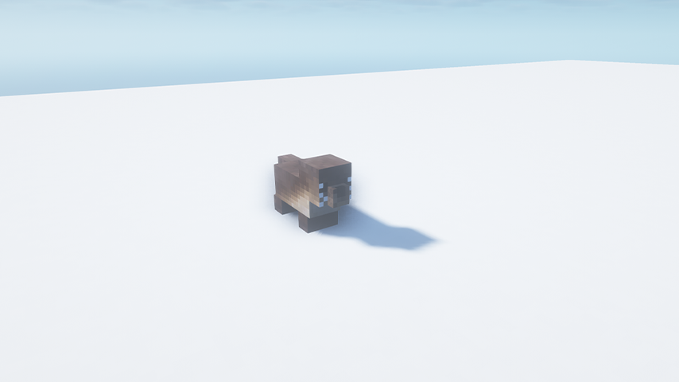
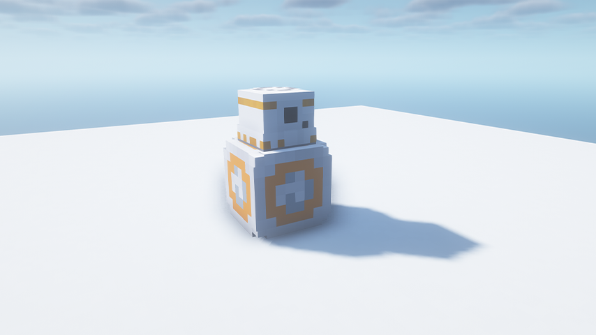
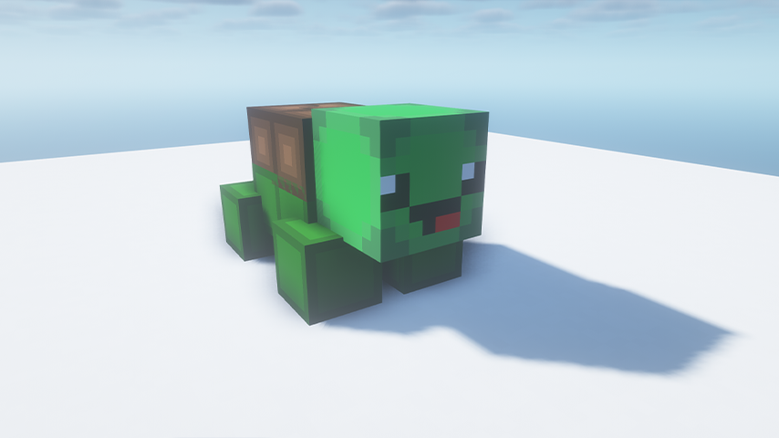
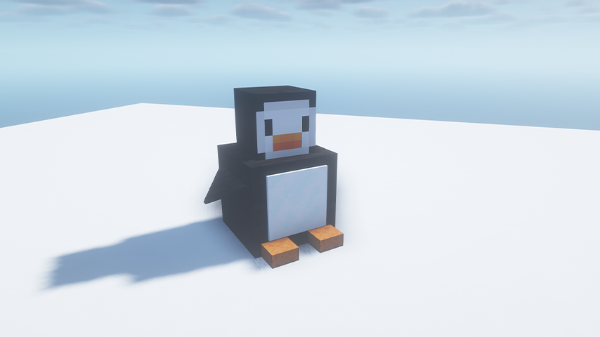
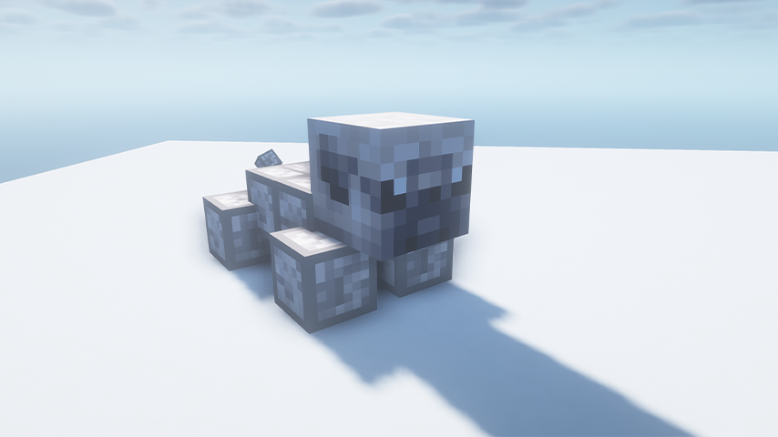
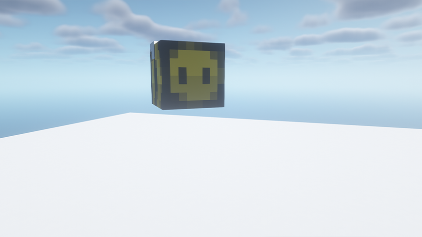
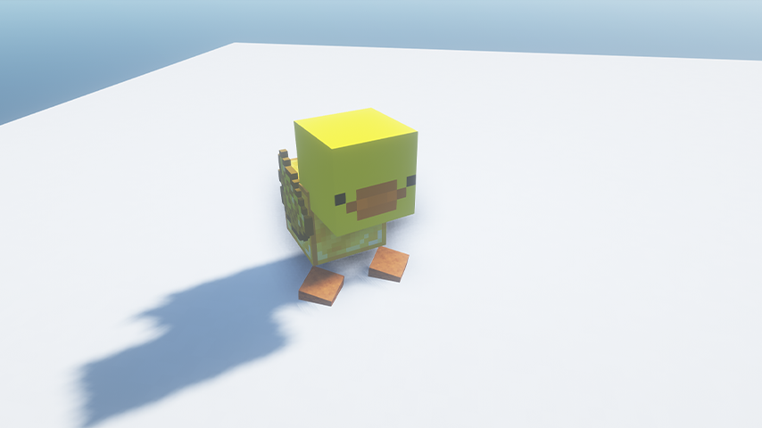
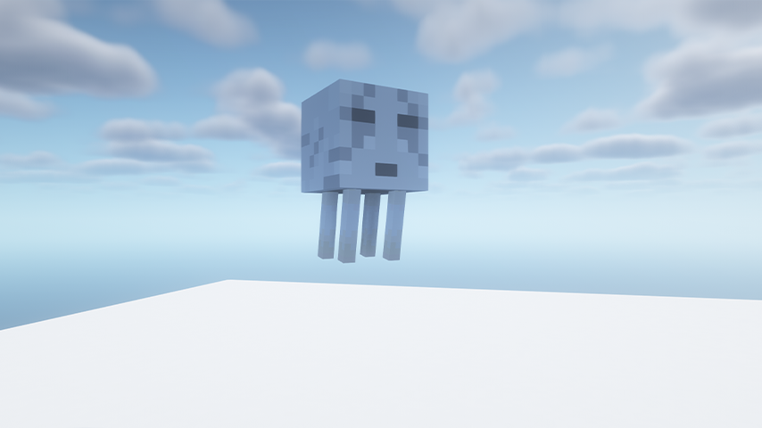
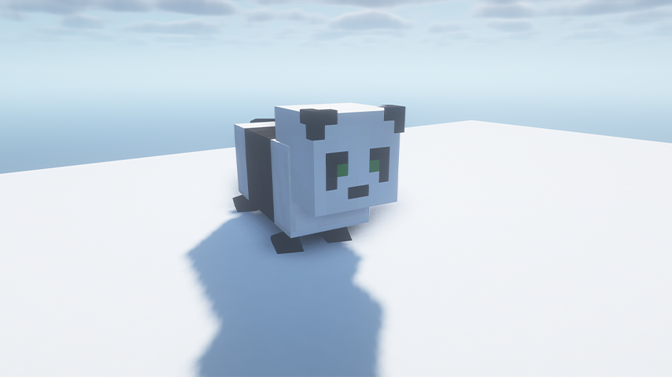

# Pets
There are many varieties of pets you can own! There are 2 main types: Normal Pets and Modeled Pets.

## Normal Pets
Normal Pets are simular to vanilla Minecraft mobs, and can be managed in the `/cosmetics` menu. They can be obtained at random by purchasing a cosmetics treasure key in-game.

# Modeled Pets
Modeled pets can be bought from the `/shop` under pets. Some pets may also have an idle/moving animation. Below is the list and a preview of all modeled pets.

### Koop

### Boxer

### Dog

### River Otter

### BB-8

### Shark

### Turtle

### Penguin

### Pug

### Bee

### Duck

### Ghast

### Panda

### Snowman
