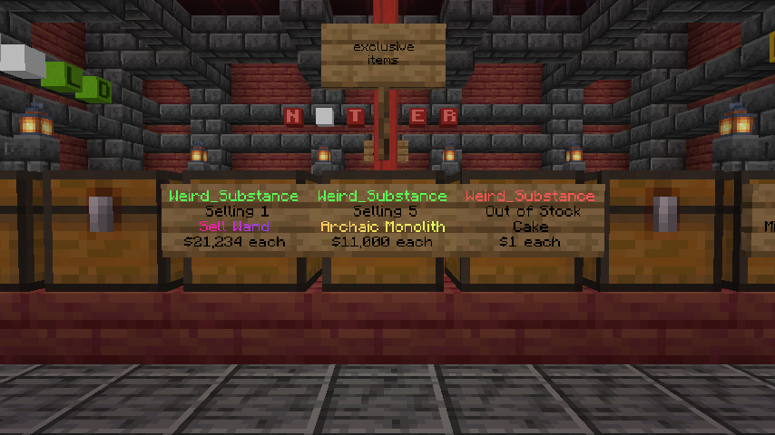

# Player Shops
How to create player shops.

Player shops can be visited in the `/warp` menu. From there, players may choose to purchase items and create their own shop. This can be a good alternative to auctions as there are no item list limits, and may catch other players' attention more effectively with your shop plot.

## Purchasing an Item

To purchase an item from a shop plot, it's simple! Just left-click a shop sign, and type the amount you want to buy in the chat. You can also preview enchantments and attributes of the item being sold as well.

## Getting Whitelisted
To build and create your own shop, you need to be whitelisted in the player shops world. To get whitelisted, you must meet the following requirements:
- Minimum of one week since the first join date on the server.
- Minimum playtime of 20 hours.
- No history of any rule violations.

If you meet these requirements and would like to apply for the whitelist, you can do so by opening a ticket on our [Discord.](https://discord.hexarchon.net/)

After being whitelisted, you will be free to do any modifications in the player shops world. However, note that the standard no-theft/griefing rules still apply. Failure to obey the rules will result in permanent suspension from trust and further consequences.

:::caution
Using excessive amounts of space (>40x40x40) in the player shops world is prohibited, unless the community deems it acceptable.
:::

:::warning
Shop chests will be protected from any players. However, any non-shop chests in the player shops world are **not protected.**
:::

## Creating a Shop
Once you are whitelisted, you can follow the steps below to create a shop.

1. Place down a chest.
2. Face the chest.
3. Hold the item you want to sell in your hand.
4. Type `/pshop create <price>`, or `/pshop create <price> <item> <amount>`.
5. Your shop is now created!

## Removing a Shop
To remove a shop, face a player shop sign and type `/pshop remove`.

## Other Commands 
`/pshop buy` - Change the shop you are facing to buy items.
`/pshop sell` - Change the shop you are facing to sell items.
`/pshop transfer <name>` - Transfer the shop you are facing to another player.
`/pshop item` - Change the item of the shop.
`/pshop find <item name>` - Find a nearby shop that matches the item name specified.

## Manage Shop

To manage an already made shop, right-click on the shop sign. From there, you can change the shop mode (selling/buying), change the price, and more!