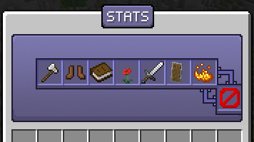
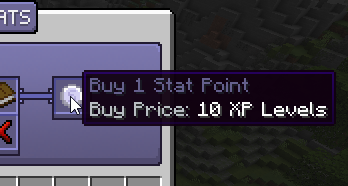

# Stats

Stats are a passive upgrade to your character, providing upgrades to complement your Custom Items and Abilities.

## Upgrading Stats

Stats can be accessed with the command `/stats`. Here are all the stats available to upgrade:

**Strength:** Increases Weapon Damage and Physical Damage.  
**Dexterity:** Increases Projectile Damage and provides Cooldown Reduction.  
**Intelligence:** Increases Magic Damage, Max Mana, and Mana Regeneration.  
**Health:** Increases Max Health.  
**Stamina:** Increases Attack Speed and Movement Speed.  
**Resistance:** Provides Knockback Resistance and Resistance against slows.  
**Criticals:** Provides Skill/Melee Critical Strike Chance and Power.  

## Obtaining Stat Points

Upgrading Stats require Stat Points, which can be purchased in the menu by using XP. The XP cost will increase by one level each time you purchase the stat point.