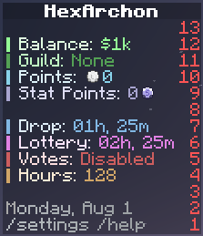

# Getting Started
All about getting started on HexArchon.

## Welcome

Welcome! On HexArchon, players can explore the wilderness, interact with other players, fight unique custom mobs, challenge various dungeons, and gear up on custom items and equipments to survive in a unique environment.

## First Steps

The first step would be to use the `/rtp` command to teleport to a random place in the wilderness. This can be a great tool for starters or for those who want to explore!

## Claiming Land

Claiming Land is an important aspect of the server as it protects your builds from others.

To claim land, first type the command `/claim`. Then, right-click two corners (blocks) of your intended claim. A confirmation menu will pop up, in which you can confirm your claim creation.

### Giving other players access to your claim
#### Shortcut
To share access of your claim to other players, use the `/trust PlayerNameHere` command. From there, you can grant permissions to build, open chests, interact with mobs, and more!  

#### Detailed

You can give access of your claim to other players, such as a friend. To do this, type the command `/claims`. Select the claim you wish to share, then click Per Player Settings. Select the player you wish to add, and under the build permission, click Enable. If you want, you can also grant them the permission to open chests, interact with mobs, blocks, and more!

:::warning
The player that you want to add to your claim to must be in the same world for them to show up!
:::

## Jobs

Jobs are a good way to earn money as they grant money for certain actions. You can join up to 3 jobs by using the command `/jobs`, and left-clicking on any 3 jobs you want.
To leave jobs, right-click on a job, or click the barrier in the bottom-right corner to leave all jobs.

:::warning
Leaving a job will cost you 15% of the experience in the job you left!
:::

## Shop

The shop is crucial to the server as it can be used to purchase various things. To open the shop, type the command `/shop`.  

In addition, most items can be sold in the shop to earn money using the command `/sell`.  
`/sell` » Opens the selling menu.  
`/sell hand` » Sells the items in your hand. *Shortcut: /sh*  
`/sell all` » Sells every item in your inventory. *Shortcut: /sa*  
`/sell handall` » Sells every item in your inventory that matches the item in your hand. *Shortcut: /sha*  

## Warps

Warps can be used to quickly teleport to a public location of interest. To open the warps menu, use the command `/warp`.

## Teleporting

The teleport command can be used to teleport to other players with ease. To send a teleport request to a player, you can use the command `/tpa <playername>.` In addition, `/tpahere <playername>` can be used to request a player to teleport to you. The specified player can choose to either accept or deny the request using `/tpyes` or `/tpno`.

:::info
The player who is teleporting must stand still for 3 seconds for the teleport to take place.
:::

## Homes

Want to save place you want, such as your house? Do a /sethome! You can then use /home to teleport back to that place.
You can also create up to 5 homes, by using `/sethome <homename>`, and using `/home <homename>`.  
To remove homes, use the `/delhome <homename>` command.  

## Death

Did you die? No worries, you can use `/back` to go back to where you died!

:::warning
You will lose 10% of your balance on death! This does not apply in Boss Arenas or Dungeons.
:::

## Auctions

The player auctions can be accessed by using /ah. From there, you can buy from others or list items for others to buy.

## Map

The Server Map offers a real-time 2D view of the entire Overworld! You can view it by using the command `/map` or by visiting [map.hexarchon.net](https://map.hexarchon.net/).

## Tree Feller

You can easily cut down trees using the tree feller! Note that it will only work on smaller trees.

#### How to use Tree Feller
1. Hold an axe.
2. Face an empty block (air).
3. Right-click holding your axe. (It should show "You ready your axe" above your hotbar)
4. Cut down the bottom of a tree within 3 seconds.

## Scoreboard

The Scoreboard is the section that is located on the right side of the screen. While it contains various useful information, if you wish to remove this display, you can do so in the `/settings` under "HUD Settings".  

**Icons:**
- Money - The amount of money you have. This can also be accessed using /bal.  
- Flag - Your current `/guild` name.  
- P Coin - The current amount of points you have, used for [abilities](gameplay-mechanics/abilities.md).  
- S Coin - The current amount of stat points you have, used for [stats](gameplay-mechanics/stats.md).  
- Chest - The time left until the next supply drop, or the time left until the current supply drop ends.  
- Yellow Ticket - The time left until the next lottery draw.  
- Present - The number of votes you have. (psst, every Month the top voters get a reward)!  

## Settings

Numerous settings on HexArchon can be toggled on or off to your likings. You can access the settings menu by using the command `/settings`.