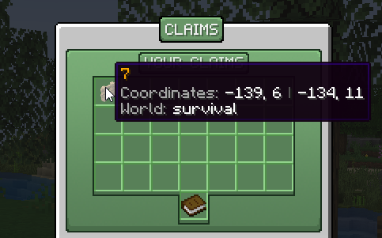

# Getting Started
All about getting started on HexArchon.

:::note
This page of the wiki is currently under construction. Some details may be missing.
:::

Welcome! On HexArchon, players can explore the wilderness, interact with other players, fight unique custom mobs, challenge various dungeons, and gear up on custom items and equipments to survive in a unique environment.

## First Steps

The first step would be to use the `/rtp` command to teleport to a random place in the wilderness. This can be a great tool for starters or for those who want to explore.

## Claiming Land

Claiming Land is an important aspect of the server as it protects your builds from others.

To claim land, first type the command `/claim`. Then, right-click two corners (blocks) of your intended claim. A confirmation menu will pop up, in which you can confirm your claim creation.

### Giving other players access to your claim
You can give access of your claim to other players, such as a friend. To do this, type the command `/claims`. Note the added `s`!

A menu of all your claims will pop up. From here, select the claim you wish to share.

A settings menu for the claim you selected will pop up. Click Per Player Settings. Then, select the player you wish to grant your claim permissions to.

Test