# FPS Boost Guide - Prism Launcher & Optimization Modpack
Is your computer on its last legs running Minecraft? Tired of low FPS, crashes, and slow resource pack apply speeds? Here's a guide for you! By using Prism Launcher and an optimization modpack, you can boost your FPS with ease.

Here is a before & after on a 10-year old potato obtained from a dumpster:

Before (26, 25, 30 FPS)            |  After (76, 86, 50 FPS)
:-------------------------:|:-------------------------:
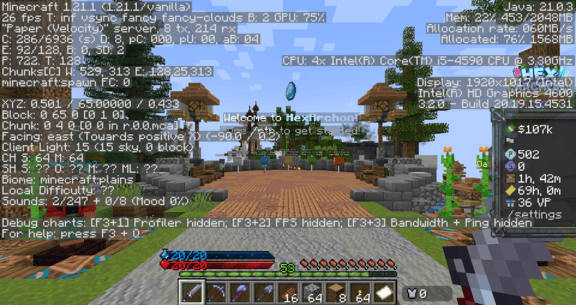  |  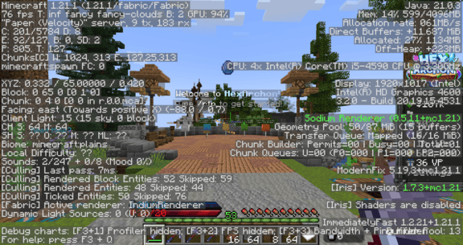
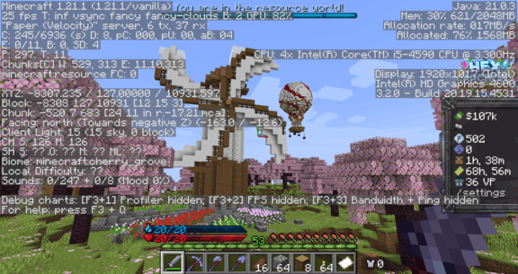 | 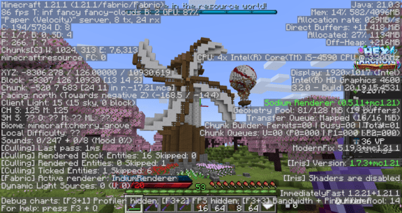
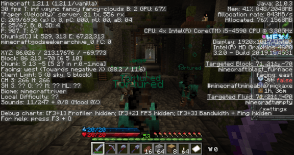 | 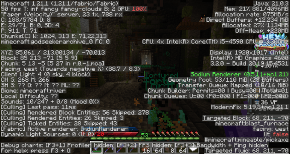

## How to install
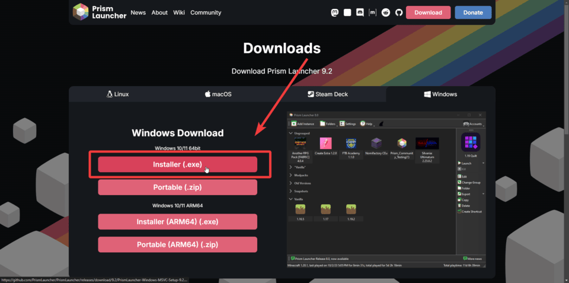  

First, navigate to the [Prism Launcher website, and download the launcher.](https://prismlauncher.org/download/windows/) If you don't know what your computer is, most likely you have to download the **64bit** Installer (.exe) version.

Once it is downloaded, run the .exe file.

 
 

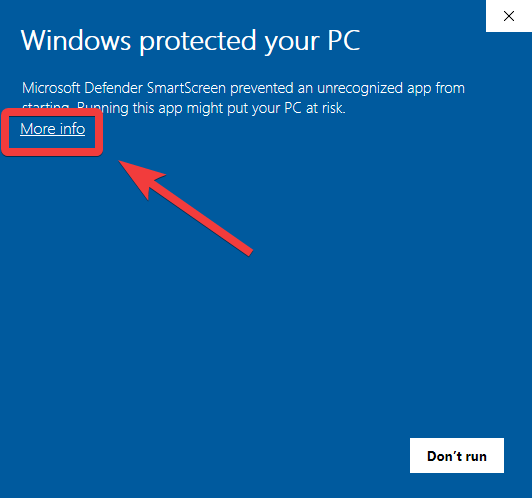  
If you get this "Windows protected your PC" pop-up, don't worry. Prism Launcher is not a virus and is an open-source community-driven project. [All the code is public here.](https://github.com/PrismLauncher/PrismLauncher/)

Simply click "More info" and "Run Anyway."

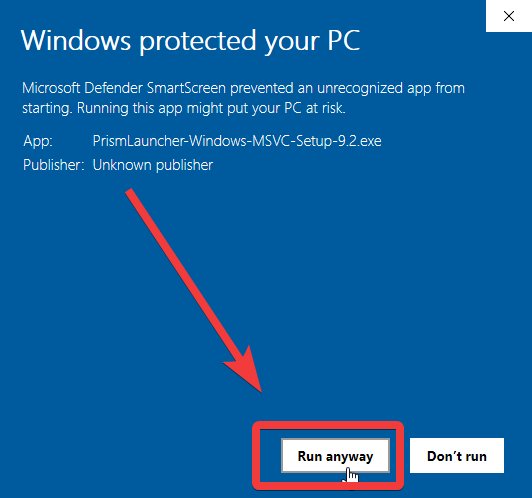  

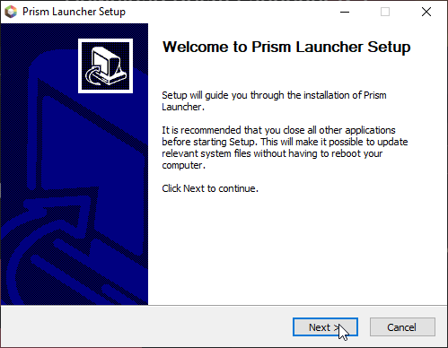  

Go through the installation process just like any other software you've installed.

Open Prism Laucher once it is done installing. If you don't see it on your desktop, try searching "Prism Launcher" on your Windows search bar (bottom bar.) It will ask you to select a language, then you should see the main menu screen below.
 
 

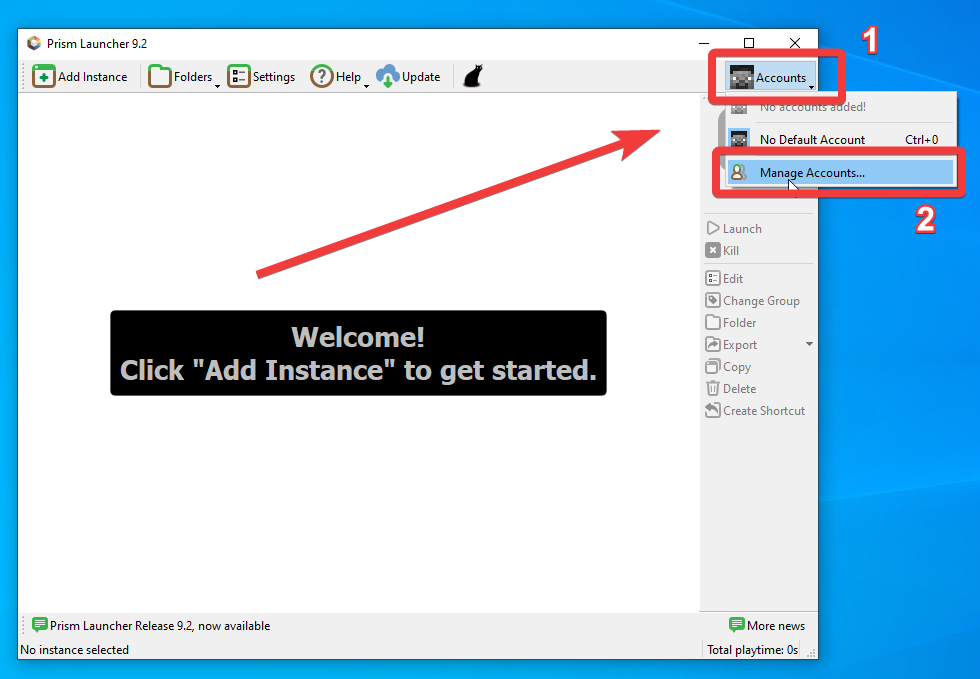  
Click **"Accounts"** at the top right, then **"Manage Accounts."**
 
 

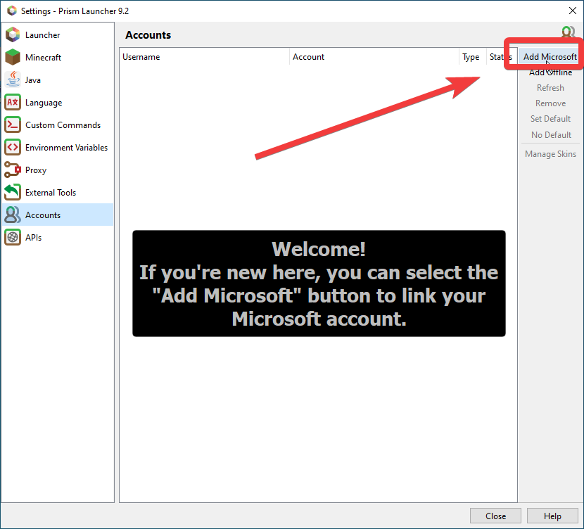  
Click **"Add Microsoft"** at the top right.
 
 

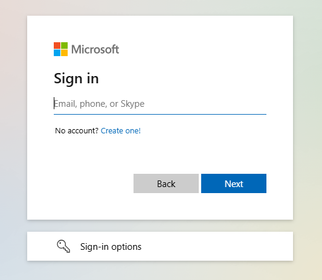  
Log in with the Microsoft account you have Minecraft on.
 
 

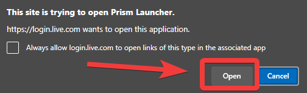  
After logging in to Microsoft, if you get a pop-up similar to this, make sure you click **"Open"** or **"Allow."**
 
 

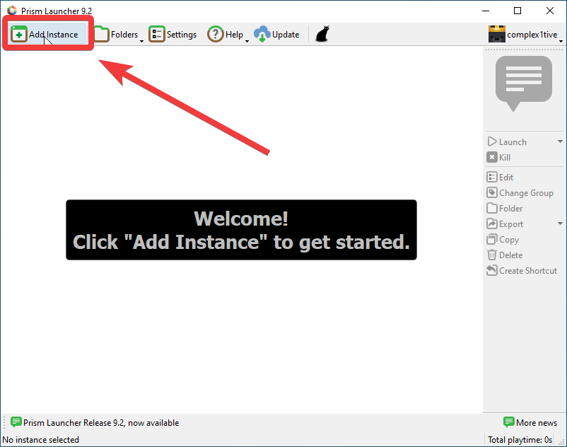  
You should now be logged into Prism Launcher **(see your profile at the top right.)** Now, click the **"Add Instance"** button on the top left corner.
 
 

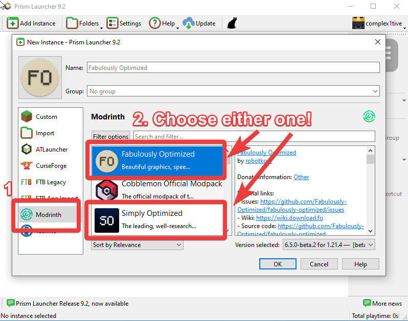  
Navigate to the **Modrinth** tab. Then, either select **"Fabulously Optimized"** or **"Simply Optimized".** This is your choice!
- Fabulously Optimized includes extra mods that may make your game look a tiny bit better. It also includes shaders support.
- Simply Optimized focuses *strictly* on FPS boosting mods. Nothing else.
 
 

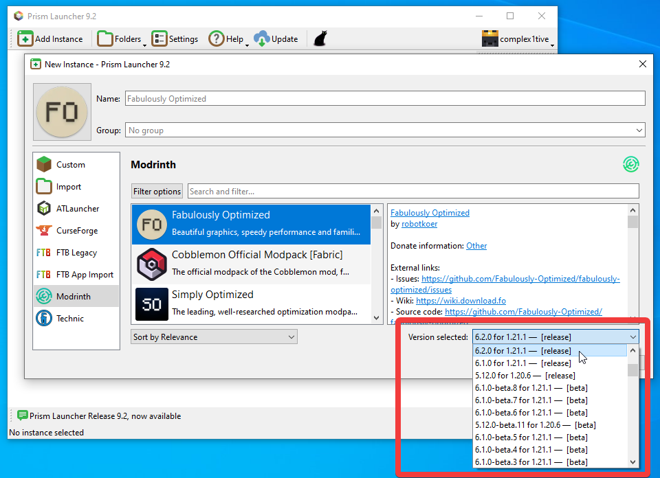  
Once you have selected either **"Fabulously Optimized"** or **"Simply Optimized"**, navigate to the bottom right corner and make sure you select the correct Minecraft version you want. Then, click OK.
 
 

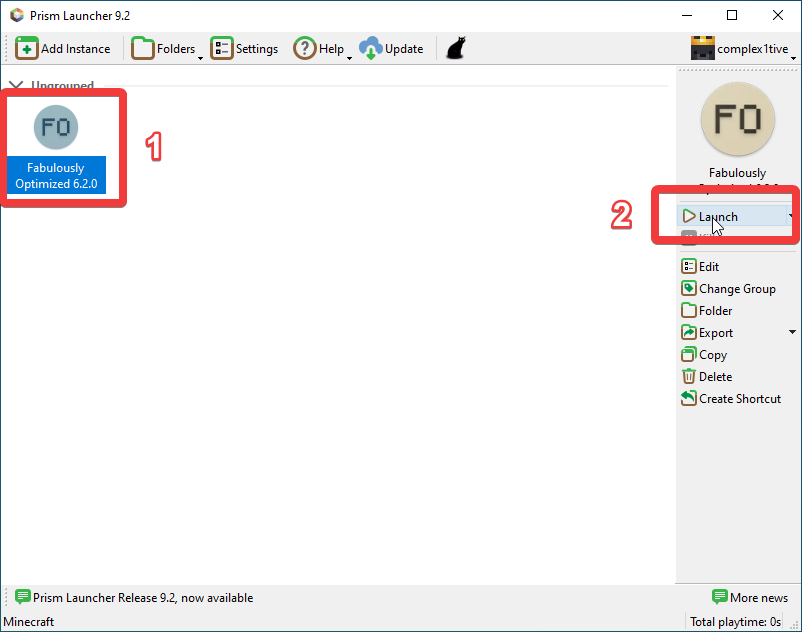  
Now, you can start the game by selecting the modpack instance, and clicking the **"Launch"** button on the right side.

:::info
The first time you join the server after, you will have to redownload the resource pack. This depends on your internet and computer speeds, and it is normal for it to take a while! After this, you should notice an improvement in resource pack apply speeds compared to Vanilla Minecraft.
:::

## Note
We are not associated with Prism Launcher or these modpacks in any way -- we are just regular users who are very satisfied with what they offer.

If you have any questions or concerns regarding installing and using Prism Launcher, you can try asking us, but ideally you should contact those over at Prism Launcher.

Prism Launcher support: https://prismlauncher.org/#get-involved