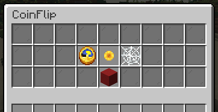

# Coinflips
How to create and participate in Coinflips.

Coinflips allow players to play a betting game. The coinflip menu can be accessed with `/cf`. You can play, view, create, and delete all your coinflips in the menu.

## Creating a Coinflip (Shortcut)
To create a coinflip, use the command `/cf create [price] [heads / tails]`.  
_Example: /cf create 1000 heads_