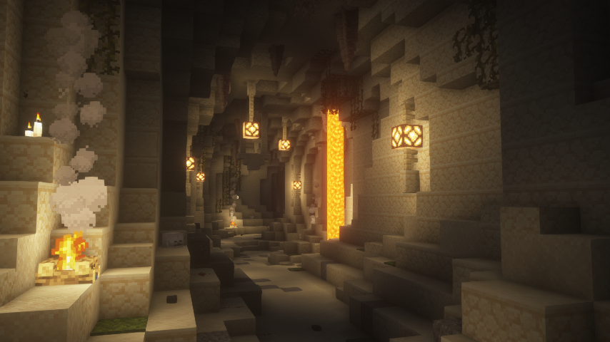

# Dungeons

Dungeons are objective-based raids that contain main & side objectives, mobs, loot chests, and bosses. Upon defeating the final boss of a dungeon, you can claim 1 of 3 reward chests which contain Runes, Custom Enchantments, Essence Powder, Materials, and Custom Items.

## Starting a Dungeon

To start a dungeon, open the dungeon menu using `/dungeons`. Select a dungeon to join. Click "Start Dungeon" to start the dungeon solo, or co-op with up to 4 players _(must have a party setup before starting)._

### Creating a Party
If you would like to start a dungeon raid with other players, they must be in your party first before you click the "Start Dungeon" button. When you click on a dungeon, you will be given the option to start inviting players.

#### Inviting Players Privately
To invite players to join your party, click the "Create Party" button. Use the `/party invite PlayerNameHere` command to invite others to join your party.

#### Inviting Players Publicly (Recruiting)
To create a global broadcast for players to join your party, click the "Recruit Players" button. Follow the steps in the chat and type your answers in the chat to start recruiting players.

## Dungeons

## Runic Temple

### Bosses:
- Runic Revenant (Mini-Boss)
- Posessed Treasure
- Runic King (Final Boss)

## Feriah Farlands

### Bosses:
- Lava Gatekeeper (Mini-Boss)
- Fire Broodmother
- Frost King Servant
- Ruined Frost King (Final Boss)

**Counterpart of Skylands:** [Feriah Farlands](skylands.md/#feriah-farlands)

## Ancient Desert

### Bosses:
- Fallen Knight (Mini-Boss)
- Seth: The Rejected
- Warrior Hyperion
- The Ancient Titan (Final Boss)