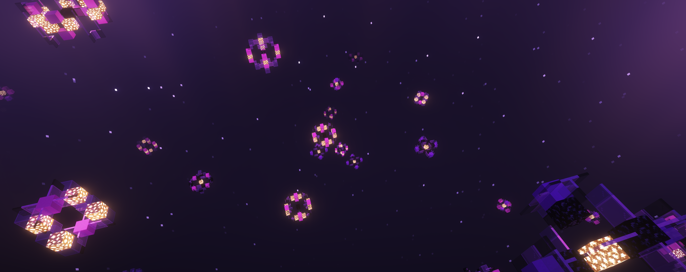

# The End
The following are the list of biomes and a brief description about the mobs in each biome.

### Aether Ancient Wastes
The Aether Ancient Wastes contain multiple pillar-like stone brick structures. They inhabit the Ruin tribe, which are neutral, but will signal every single Ruin in the area to attack if provoked.

#### Mobs:
- <u>Ruin Walker</u>: Walkers have a desired item seen in their offhand. A trade can be done by right-clicking them with their desired item in your hand. Ruin Walkers can give a variety of items such as endergems, diamonds, and runes. Ruin Walkers will stop trading after a random number of times, or if provoked by an attacker. Bundles mean a trade cannot be done.
- <u>Ruin Jockey</u>: Jockeys will be seen riding a zombie horse and will not attack unless you attack them. They cannot be traded with.
- <u>Ruin Trive Leader (Mini Boss)</u>: Appearance of a gray knight with a katana. Attacking does not signal other Ruins to attack.

### Aether Azure Forest
The Aether Azure Forest is populated with many azure trees with small caves. Whirlwinds can spawn in this biome.

#### Mobs:
- <u>Aether Guard</u>: Hostile knights that can drop Aether Crust on death.
- <u>Blue Moa</u>: A passive avian that can be mounted on.

### Aether Bristled Forest
The Aether Bristled Forest is populated with many leafless trees.

#### Mobs:
- <u>Ether Witch</u>: Fast hostile witches that can cast a variety of spells. Drops mana dust and bottled spells.

### Aether Cloudlands
The Aether Cloudlands consists entirely of cloud shaped white stained glass.

#### Mobs:
- <u>Aerslime</u>: Passive block of clouds.

### Aether Crimson Heights
The Aether Crimson Heights is a red high altitude biome. Whirlwinds can spawn in this biome.

#### Mobs:
- <u>Aether Guard</u>: Hostile knights that can drop Aether Crust on death.
- <u>Crimson Runespirit</u>: A neutral golem without legs.
- <u>Rubislime</u>: A small hostile red slime. When killed, it will explode dealing area damage.
- <u>White Moa</u>: A passive avian that can be mounted on. White Moa's have a higher jump boost.

### Aether Grim Woodlands
The Aether Grim Woodlands is a dark and webbed black leaf forest.

#### Mobs:
- <u>Peacekeeper</u>: A hostile axe wielding entity.

### Amethyst End
The Amethyst End is a rocky obsidian landscape with giant amethyst spikes.

#### Mobs:
- <u>Amethystal</u>: A neutral amethyst entity that can grow amethyst crystals out of the ground. Drops Amethyst Petals on death.
- <u>Crystal Golem</u>: A neutral golem that can regrow itself in a different location when in combat.
- <u>The End Giant</u>: A neutral giant golem made mostly out of obsidian. Drops a Guardian Runestone on death.

### Choruve Forest
The Choruve Forest is full of dead corals, and pink choruve trees.

#### Mobs:
- <u>Chorufly</u>: A passive flying bug which can spread a damaging gas on death. 
- <u>Whispering Phantom</u>: A neutral whispering ghost that shoots weakening projectiles in combat. Drops a Hollow heart on death.

### Corrupted End
The corrupted end is a high-altitude biome mixed with black and purple concrete, and obsidian.

#### Mobs:
- <u>Cosmic Delusion</u>: A neutral enderman with a block of crying obsidian bound to its head. Can drop unstable fragments and summon the Corruption of The Void on death when in this biome.
- <u>Corruption of The Void (Mini Boss)</u>: A giant enderman-like entity with large hands. Drops Arcane Fragments on death.

### Dark End
A dark and jagged land of dust. Wandering in this area is extremely dangerous.

#### Mobs:
- <u>Sentry</u>: A fast and hostile entity that will only detect you if close. Killing it is not recommended...
- <u>???</u>: The only way to survive is to run.

### Pearlescent End
A bright multi-layer cave with big chains holding it together.

#### Mobs:
- <u>Ethereal</u>: A neutral ghost wielding a sword that deals a portion of your max HP as damage. Drops Etheric Mist on death.
- <u>Etheric Shulker</u>: A hostile floating shulker that shoots damaging beams.  Drops Etheric Shell on death.

### Shattered End/Forest
The Shattered End and Shattered Forest contain obsidian pillars or trees, with a cracked end stone landscape.

#### Mobs:
- <u>Hexed Eye</u>: A hostile flying eye that shoots projectiles. Drops Bewitched Eyes on death.
- <u>Enderweaver</u>: A fast moving spider. Drops Glowing Eyes on death.

### Starfield
A spacious void containing stars. Stardust can be seen flying around this biome.

#### Mobs:
- <u>Starlight Fairy</u>: A passive spec of starlight that drops Shining Stars on death.

### Warped Barrens/Grove
The Warped Barrens contains nether warped vegetation, twisting vines, and large warped mushrooms.

#### Mobs:
- <u>Grove Guardian</u>: Neutral golem that inflicts a grove poisoning on hit in combat. 
- <u>Warpulon</u>: A passive jellyfish-like mob that slowly floats around. When attacked it will release electric sparks, dealing damage.
- <u>Watcher</u>: A neutral flying eye of ender. When attacked, it will fly towards you to attack.
- <u>Watcher Cultist</u>: A neutral robed mage. When attacked, it will signal Watchers in the area to attack you. Additionally, it will signal one Watcher in radius to break, releasing a projectile towards you.